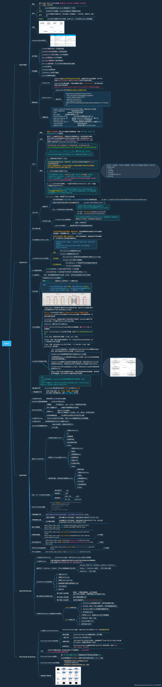
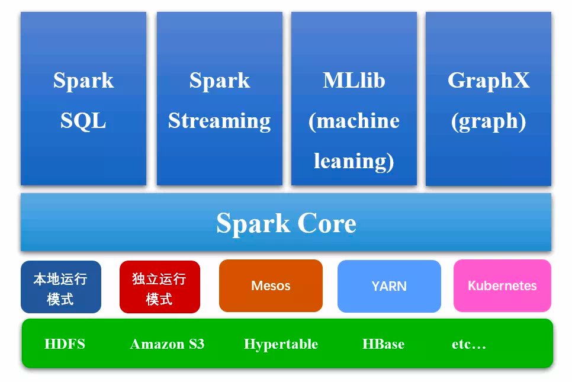
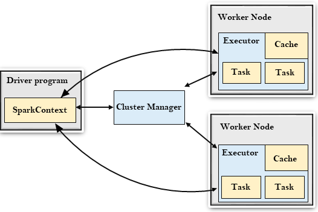
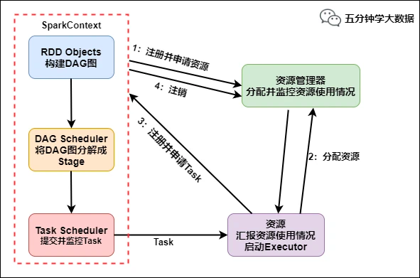

> ☕ **JavaCore** 是一个 Java 核心技术教程。
>
> - 🔁 项目同步维护：[Github](https://github.com/dunwu/javacore/) | [Gitee](https://gitee.com/turnon/javacore/)
> - 📖 电子书阅读：[Github Pages](https://dunwu.github.io/javacore/) | [Gitee Pages](http://turnon.gitee.io/javacore/)

|               1️⃣                |               2️⃣                |           3️⃣            |           4️⃣            |         5️⃣         |             6️⃣              |
| :-----------------------------: | :-----------------------------: | :---------------------: | :---------------------: | :----------------: | :-------------------------: |
| [Java 基础特性](#java-基础特性) | [Java 高级特性](#java-高级特性) | [Java 容器](#java-容器) | [Java 并发](#java-并发) | [JavaIO](#java-io) | [Java 虚拟机](#java-虚拟机) |

# 📖 内容

## [spark入门](basics)

- [spark 架构设计](basics/spark-core.md)
  - 

- [spark 运行流程](basics/spark-core.md)
  - 

- [spark 核心概念](basics/spark-core.md)
  - [Spark Driver](basics/spark-core.md)
  - [Spark Executor]
  - [Cluster Manager]
  - job & task
  - Stage
- [spark 环境部署](basics/spark-develop-env.md)
- [spark 运行原理](basics/spark-core.md)

## [spark core](sparkcore)

### [RDD](sparkcore/RDD/)

- [spark ](sparkcore/RDD//basic-grammar.md)

### [项目](sparkcore/RDD/)

## [spark sql](sparksql)

## [spark streaming](sparkstreaming)

- [spark ](sparkstreaming/java-basic-grammar.md)

## [scala编程](scala)

- [Java 正则从入门到精通](advanced/java-regex.md) - 关键词：`Pattern`、`Matcher`、`捕获与非捕获`、`反向引用`、`零宽断言`、`贪婪与懒惰`、`元字符`、`DFA`、`NFA`

### [Java 容器](container)

- [Java 容器简介](container/java-container.md) - 关键词：`Collection`、`泛型`、`Iterable`、`Iterator`、`Comparable`、`Comparator`
  、`Cloneable`、`fail-fast`

### [Java 并发](concurrent)

- [Java 并发简介](concurrent/Java并发简介.md) - 关键词：`进程`、`线程`

### [Java IO](io)

- [Java IO 模型](io/java-io.md) - 关键词：`InputStream`、`OutputStream`、`Reader`、`Writer`

### [Java 虚拟机](jvm)

- [JVM 体系结构](jvm/jvm-architecture.md)

## 📚 资料

- **书籍**
    - Java 四大名著
        - [《Java 编程思想（Thinking in java）》](https://book.douban.com/subject/2130190/)
- **教程、社区**
    - [Runoob Java 教程](https://www.runoob.com/java/java-tutorial.html)
- **面试**
    - [CS-Notes](https://github.com/CyC2018/CS-Notes)

## 🚪 传送

◾ 🏠 [JAVACORE 首页](https://github.com/dunwu/javacore) ◾ 🎯 [我的博客](https://github.com/dunwu/blog) ◾

> 你可能会感兴趣：

- [Java 教程](https://github.com/dunwu/java-tutorial) 📚
