# RDD

> 📌 **关键词：** `RDD`、`stage`、`Transformations& Actions`、`宽依赖&窄依赖`、`分区`


<!-- TOC depthFrom:2 depthTo:3 -->

- [1. rdd是什么](#1-rdd是什么)
- [2. 创建方式](#2-创建方式)
    - [2.1. 通过读取文件生成的](#21-通过读取文件生成的)
    - [2.2. 通过并行化的方式创建RDD](#22-通过并行化的方式创建RDD)
- [3. rdd并行度与分区](#3-rdd并行度与分区)
- [4. 常用RDD算子](#4-环境变量)
    - [4.1. Transformation](#41-Transformation)
       - [单Value类型](#单Value类型)
       - [双Value类型](#双Value类型)
       - [Key-Value类型](#Key-Value类型)
    - [4.2. Action](#42-Action)
- [5. RDD依赖关系](#5-RDD依赖关系)
    - [5.1. 宽依赖](#51-宽依赖)
    - [5.2. 窄依赖](#52-窄依赖)
    - [5.3. 总结](#53-总结)
- [6. 任务划分](#6-任务划分)
    - [6.1. stage划分](#61-stage划分)
    - [6.2. DAG&job&Action&分区&关系](#62-DAG&job&Action&分区&关系)
- [7. 持久化](#7-持久化)
    - [7.1. persist与cache](#71-persist与cache)
    - [7.2. checkpoint](#72-checkpoint)
    - [7.3. cache vs persist vs checkpoint](#73-cache vs persist vs checkpoint)
- [8. 序列化](#8-序列化)

<!-- /TOC -->

# 1. rdd是什么

RDD(Resilient Distributed Dataset) 弹性分布式数据集

### 定义

- 数据集
    - 存储数据的计算逻辑
- 分布式
    - 数据来源：从不同网络结点读取数据
    - 计算：拆分成不同任务，发送给不同的excute
    - 数据存储
- 弹性
    - 依赖关系
        - 维护血缘关系
    - 计算
        - 计算基于内存，性能高，可与磁盘灵活切换
    - 分区
        - 可通过指定算子改变分区数量，并行计算
        - 数据不同，计算逻辑相同
    - 容错
        - 重试处理

### 特性：

* 只读 - 只能通过算子创建新的RDD，原RDD未受影响【算子】
* 分区 - 每个 RDD 被切分成多个分区(partition), 每个分区可能会在集群中不同的节点上进行计算
* 依赖关系可并行 - DAG，划分并行
* 缓存&持久化

# 2. 创建方式

## 2.1. 通过读取文件生成的

- 以行为单位，读取数据都是字符串

```scala
val rdd1 = sc.textFile("hdfs://node1:8020/wordcount/input/words.txt")
```

- 以文件为单位

```scala
val rdd1 = sc.whoTextFiles("hdfs://node1:8020/wordcount/input/words.txt")
```


## 2.2. 通过并行化的方式创建RDD

```scala
num_rdd = sc.parallelize([1,2,3]) //parallelize 并行
```

或

```scala
val rdd = sc.makeRDD(List(1, 2, 3, 4), 2) // 2为分区，不写会有默认值
```

makeRDD方法底层调用了parallelize方法

## 2.3. 其他方式

# 3 rdd并行度与分区

## 分区算法

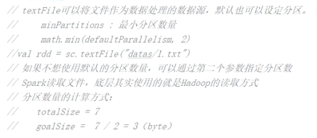

- 偏移量 

```text
例子： 
    最小分区：3 
    文件内容：
            1
            2
            3
结果： 文件1： 1 2 文件2：3 文件3： 空
```

# 4. 常用RDD算子

```
     算子：Operator(操作)
        RDD的方法和Scala集合对象的方法不一样
        集合对象的方法都是在同一个节点的内存中完成的
        RDD的方法可以将计算逻辑发送到Executor端（分布式节点）执行
        为了区分不同的处理效果，所以将RDD的方法称为算子
        RDD的方法外部的操作都是在Driver端执行的，而方法内部的逻辑代码是在Executor端执行的
```

**`惰性求值`**

- Transformations ：从一个已知的 RDD 中创建出来一个新的 RDD
- Actions： 在数据集上计算结束之后, 给驱动程序返回一个值

在 Spark 中几乎所有的transformation操作都是`懒执行`的(lazy).

只有遇到action，才会执行 RDD 的计算(即延迟计）,只有遇到action，才会执行 RDD 的计算(即延迟计）

## 4.1. Transformation

将旧的RDD包装成新的RDD

### 单Value类型

1. map
- 功能
  * 一个分区 数据顺序执行
  * 不同分区间 无序

```scala
import org.apache.spark.rdd.RDD
import org.apache.spark.{SparkConf, SparkContext}

object Spark01_RDD_Operator_Transform_Part {
  def main(args: Array[String]): Unit = {
    val sparkConf: SparkConf = new SparkConf().setMaster("local[*]").setAppName("Operator")
    val sc = new SparkContext(sparkConf)

    // TODO 算子 —— map
    //将同一个分区的数据直接转换为相同类型的内存数组进行处理，分区不变
    val rdd: RDD[Int] = sc.makeRDD(List(1, 2, 3, 4), 2)
    //[1,2],[3,4]
    rdd.saveAsTextFile("output")
    val mapRDD: RDD[Int] = rdd.map(_ * 2)
    //[2,4],[6,8]
    mapRDD.saveAsTextFile("output1")
    sc.stop()
  }
}
  ```  

2. mapPartitions 考虑分区

- 语法

  ```mapPartitions(func) Iterator<T> => Iterator<U>```

- 应用场景
  *  每个分区最大值或对分区数据做批处理

- 🏠`map vs mapPartitions`
   * mapPartitions 性能更高，每个分区一次拿到所有数据

   e.g. 假设有N个元素，有M个分区，那么map的函数的将被调用N次, 而mapPartitions被调用M次,一个函数一次处理所有分区。
   * mapPartitions 内存有限时不推荐 处理完的数据不会被释放，存在对象引用，数据量较大的时候，容易内存溢出，此时应考虑map
   * map 转换后数量不变，mapPartitions可以改变

```scala
package spark.core.rdd.transform

import org.apache.spark.rdd.RDD
import org.apache.spark.{SparkConf, SparkContext}

object mapPartitions {
  def main(args: Array[String]): Unit = {
    val sparkConf: SparkConf = new SparkConf().setMaster("local[*]").setAppName("Operator")
    val sc = new SparkContext(sparkConf)

    val rdd: RDD[Int] = sc.makeRDD(List(1, 2, 3, 4), 2)
//    val mpRDD: RDD[Int] = rdd.mapPartitions(
//      iter => {
//        println(">>>>")
//        iter.map(_ * 2)
//      }
//    )

    // 最大值
    val mpRDD: RDD[Int] = rdd.mapPartitions(
      iter => {
        List(iter.max).iterator
      }
    )

    mpRDD.collect().foreach(println)

    sc.stop()
  }
}

```

3. mapPartitionsWithIndex 索引号

- 语法

  ``` mapPartitionsWithIndex(func) (Int, Iterator<T>) => Iterator<U>```
- 功能
    * 多提供一个Int值来表示分区的索引
    * 分区数的确定, 和对数组中的元素如何进行分区
- 示例代码 
  * 取某个分区数据

```scala
package spark.core.rdd.transform

import org.apache.spark.rdd.RDD
import org.apache.spark.{SparkConf, SparkContext}

object mapPartitionsWithIndex {
  def main(args: Array[String]): Unit = {
    val sparkConf: SparkConf = new SparkConf().setMaster("local[*]").setAppName("Operator")
    val sc = new SparkContext(sparkConf)

    val rdd: RDD[Int] = sc.makeRDD(List(1, 2, 3, 4), 2)
    val mpiRDD: RDD[Int] = rdd.mapPartitionsWithIndex(
      (index, iter) => {
        if (index == 1) {
          iter
        } else {
          Nil.iterator
        }
      }
    )

    mpiRDD.collect().foreach(println)

    sc.stop()

  }
}
```
     
4. flatMap 扁平化
- 功能 
  * 扁平化
- 场景
  * 如[[1, 2] [3, 4]] = > [1, 2, 3, 4]
  * 拆分单词 "Hello Scala", "Hello Spark" => Hello  Scala Hello Spark
  
- 代码

```scala
/*
[1, 2] [3, 4] = > [1, 2, 3, 4]
*/
package spark.core.rdd.transform

import org.apache.spark.rdd.RDD
import org.apache.spark.{SparkConf, SparkContext}

object flatMap {
  def main(args: Array[String]): Unit = {
    val sparkConf: SparkConf = new SparkConf().setMaster("local[*]").setAppName("Operator")
    val sc = new SparkContext(sparkConf)

    val rdd: RDD[List[Int]] = sc.makeRDD(List(List(1, 2), List(3, 4)), 2)
    val flatrdd: RDD[Int] = rdd.flatMap(
      List => {List}
    )

    flatrdd.collect().foreach(println)

    sc.stop()

  }
}
```

* ～模式匹配～
```scala
val rdd = sc.makeRDD(List(List(1, 2), 3, List(4, 5)))

val flatMapRDD = rdd.flatMap(
  data => {
    data match {
      case list: List[_] => list
      case dat => List(dat)
    }
  }
)
```
5. glom 将每个分区形成一个数组
- 用法

     ```RDD[Array[T]] ```
- 功能 
     * 将每个分区形成一个数组
     * 分区个数不变
- 代码
   
   * 打印各分区数据

   ```scala
    val rdd: RDD[Int] = sc.makeRDD(List(1, 2, 3, 4), 2)
    val glomRDD: RDD[Array[Int]] = rdd.glom(
    )

    glomRDD.foreach(arr => println(arr.mkString(",")))
   /*
    1,2
    3,4
   */
   ```
   
   * 求各分区最大值之和

    ```scala
    val rdd: RDD[Int] = sc.makeRDD(List(1, 2, 3, 4), 2)
    val glomRDD: RDD[Array[Int]] = rdd.glom()
    val maxRDD: RDD[Int] = glomRDD.map(array => {
      array.max
    })
    println(maxRDD.collect().sum)
    // 结果：6
    ```
  
6. groupBy
- 用法
     
   ```groupBy(func) RDD[(K, Iterable[T])```
- 功能 
     * 按照func的返回值做为key进行分组
     * shuffle
     
- 代码
   
    ```scala
    val rdd = sc.makeRDD(List(1, 2, 3, 4))
    val groupRDD: RDD[(Int, Iterable[Int])] = rdd.groupBy((_%2)
    groupRDD.collect().foreach(println)
    ```

7. filter
- 用法
- 功能 
     * 过滤
     * 产生数据倾斜 分区各区数据差别较大

8. sample 随机采样
- 用法

    sample算子需要传递三个参数
     * 第一个参数  抽取数据后是否将数据返回 
       * true（返回：（泊松算法）） false（不返回：（伯努利算法））
     * 第二个参数 每个数据出现概率
        * 如果抽取不放回的场合：数据源中每条数据被抽取的概率,基准值的概念
        * 如果抽取放回的场合：表示数据源中的每条数据被抽取的可能次数
     * 第三个参数 随机算法种子 如果不传，则使用当前时间
- 功能 
     * 数据倾斜时应用

- 代码
```scala
  import org.apache.spark.rdd.RDD
  import org.apache.spark.{SparkConf, SparkContext}
  
  object Spark08_RDD_Operator_Transform {
    def main(args: Array[String]): Unit = {
      val sparkConf: SparkConf = new SparkConf().setMaster("local[*]").setAppName("Operator")
      val sc = new SparkContext(sparkConf)
  
      // TODO 算子 —— sample
      val rdd: RDD[Int] = sc.makeRDD(List(1, 2, 3, 4, 5, 6, 7, 8, 9, 10))
  
      /*val sampleRDD: RDD[Int] = rdd.sample(
        false,
        0.4
        //1
      )*/
  
      val sampleRDD: RDD[Int] = rdd.sample(
        true,
        2
        //1
      )
  
      println(sampleRDD.collect().mkString(","))
      sc.stop()
    }
  }
```

9. distinct


```scala
import org.apache.spark.rdd.RDD
import org.apache.spark.{SparkConf, SparkContext}

object Spark09_RDD_Operator_Transform {
  def main(args: Array[String]): Unit = {
    val sparkConf: SparkConf = new SparkConf().setMaster("local[*]").setAppName("Operator")
    val sc = new SparkContext(sparkConf)

    // TODO 算子 —— distinct
    val rdd: RDD[Int] = sc.makeRDD(List(1, 2, 3, 4, 1, 2, 3, 4))

    //map(x => (x, null)).reduceByKey((x, _) => x, numPartitions).map(_._1)
    //(1,null),(2,null),(3,null),(4,null),(1,null),(2,null),(3,null),(4,null) map
    //(1,null),(1,null)... reduceByKey
    //(null,null) => null...
    //(1,null) => 1...  map
    val distinctRDD: RDD[Int] = rdd.distinct()

    println(distinctRDD.collect().mkString(","))
    sc.stop()
  }
```
10. coalesce 缩减/扩大分区
- 功能
     - 缩减分区数，第二个参数shuffle
       - 默认参数: 数据没有被打乱，可能导致`数据倾斜`
       - 如果想让数据均衡，可以使用shuffle进行处理
     - 扩大分区，必须shuffle，否则若不能打乱数据，相当于没有起作业
- 代码

```scala
package spark.core.rdd.transform

import org.apache.spark.rdd.RDD
import org.apache.spark.{SparkConf, SparkContext}

object coalesce {
  def main(args: Array[String]): Unit = {
    val sparkConf: SparkConf = new SparkConf().setMaster("local[*]").setAppName("Operator")
    val sc = new SparkContext(sparkConf)

    // TODO 算子 —— coalesce
    val rdd: RDD[Int] = sc.makeRDD(List(1, 2, 3, 4, 5, 6), 3)

    //coalesce方法默认情况下不会将分区的数据打乱重新组合（shuffle）
    //这种情况下的缩减分区可能会造成数据不均衡，出现数据的倾斜
    //val newRDD: RDD[Int] = rdd.coalesce(2)

    //如果想让数据均衡，可以使用shuffle进行处理
    val newRDD: RDD[Int] = rdd.coalesce(2, true)
    newRDD.saveAsTextFile("output")

    sc.stop()
  }
}
   ```

11. repartition 
- 用法
  * 扩大分区，底层是coalesce，参数：shuffle


12. sortBy 根据指定规则排序
- 代码
```scala
package spark.core.rdd.transform


import org.apache.spark.rdd.RDD
import org.apache.spark.{SparkConf, SparkContext}

object sortBy {
 def main(args: Array[String]): Unit = {
   val sparkConf: SparkConf = new SparkConf().setMaster("local[*]").setAppName("Operator")
   val sc = new SparkContext(sparkConf)

   // TODO 算子 —— coalesce
   val rdd: RDD[Int] = sc.makeRDD(List(1, 4, 2, 5, 3), 2)

   val mapRDD: RDD[Int] = rdd.sortBy(num => num)
   mapRDD.saveAsTextFile("sort_output")

   sc.stop()
 }
}
/*
两个分区：
1, 2, 3
4, 5, 6
*/
```

### 双Value类型
1. intersection 
2. union 
3. subtract 
4. zip 一一对应 分区数量相同，分区内数据类型相同
    * List(1, 2, 3, 4)，List(3, 4, 5, 6)=> (1,3),(2,4),(3,5),(4,6)

* 交集、并集和差集要求两个数据源数据类型要保持一致 *

### Key-Value类型
  1. partitionBy
 - 功能
   - 根据partitioner对数据重新分区 对数据重新分区，数据打乱
   - 如果原有的partionRDD和现有的partionRDD是一致的话就不进行分区，判断相等： 类型和分区个数
   - coalesce vs  partitionBy coalesce 只增加分区，数据不一定改变
 - 代码
  ```scala
import org.apache.spark.rdd.RDD
import org.apache.spark.{HashPartitioner, SparkConf, SparkContext}

object partitionBy {
  def main(args: Array[String]): Unit = {
    val sparkConf: SparkConf = new SparkConf().setMaster("local[*]").setAppName("Operator")
    val sc = new SparkContext(sparkConf)

    // TODO 算子 —— Key-Value 类型 —— partitionBy
    val rdd: RDD[Int] = sc.makeRDD(List(1, 2, 3, 4))
    val rdd1: RDD[(Int, Int)] = rdd.map(num => {
      (num, 1)
    })
    //RDD => PairRDDFunctions
    //partitionBy是PairRDDFunctions中的方法
    //是通过隐式转换（二次编译）实现的

    //partitionBy根据指定的分区规则对数据进行重新分区
    //HashPartitioner 和数量相同，分区器相等
    //RangePartitioner
    rdd1.partitionBy(new HashPartitioner(2)).saveAsTextFile("partition_soutput")
    sc.stop()
  }
}
 ```
  2. groupByKey

```scala
val rdd: RDD[(String, Int)] = sc.makeRDD(List(
    ("a", 1), ("a", 3), ("a", 2), ("b", 4)
  ))

  //groupByKey:将数据源中的数据，相同key的数据分在一个组中，形成一个对偶元组
  //           元组第一个元素就是key
  //           元组第二个元素就是相同key的value的集合
  val groupRDD: RDD[(String, Iterable[Int])] = rdd.groupByKey()
  //(a,CompactBuffer(1, 3, 2)),(b,CompactBuffer(4))
  println(groupRDD.collect().mkString(","))

  val groupRDD1: RDD[(String, Iterable[(String, Int)])] = rdd.groupBy(t => t._1)
  //(a,CompactBuffer((a,1), (a,3), (a,2))),(b,CompactBuffer((b,4)))
  println(groupRDD1.collect().mkString(","))
```

  3. reduceByKey
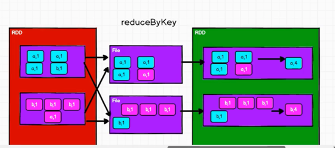
- ⚠️注意
    
   reduceByKey中如果一个key的数据只有一个，是不会参与运算的
- 代码
```scala
import org.apache.spark.rdd.RDD
import org.apache.spark.{HashPartitioner, SparkConf, SparkContext}

object reduceByKey_Transform {
  def main(args: Array[String]): Unit = {
    val sparkConf: SparkConf = new SparkConf().setMaster("local[*]").setAppName("Operator")
    val sc = new SparkContext(sparkConf)

    // TODO 算子 —— Key-Value 类型 —— reduceByKey
    val rdd: RDD[(String, Int)] = sc.makeRDD(List(
      ("a", 1), ("a", 3), ("a", 2), ("b", 4)
    ))
    //reduceByKey:相同的key的数据进行value数据的聚合操作
    //[1,2,3] => [3,3] => [6]

    val reduceRDD: RDD[(String, Int)] = rdd.reduceByKey((x, y) => {
      //reduceByKey中如果一个key的数据只有一个，是不会参与运算的
      println(s"x = ${x},y = ${y}")
      x + y
    })

    println(reduceRDD.collect().mkString(",")) //(a,6),(b,4)
    sc.stop()
  }
}
```
  ** reduceByKey和groupByKey的区别 **
  * groupByKey 会被shuffle再聚合，需等待，占用内存，需落盘处理
  * reduceByKey 
    * 性能高， 在分区内先聚合再shuffle，可减少shuffle数据量 
    * 分区内和分区间运算规则相同
  4. aggregateByKey
     - 功能
    
       ```
       aggregateByKey[U: ClassTag](zeroValue: U)(seqOp: (U, V) => U, combOp: (U, U) => U)
       ```
       `分区内` 和 `分区间` 运算规则可不同

        * 第一个参数列表【zeroValue】，需要传递一个参数，表示为初始值
            主要用于碰见第一个key的时候，和value进行分区内计算
        * 第二个参数列表需要传递两个参数【(seqOp, combOp, [numTasks])】
               * seqOp 第一个参数表示分区内计算规则
               * combOp第二个参数表示分区间计算规则
        * 结果与初始值类型一致
      
       - 代码    
         - 取出每个分区内相同 key 的最大值然后分区间相加
          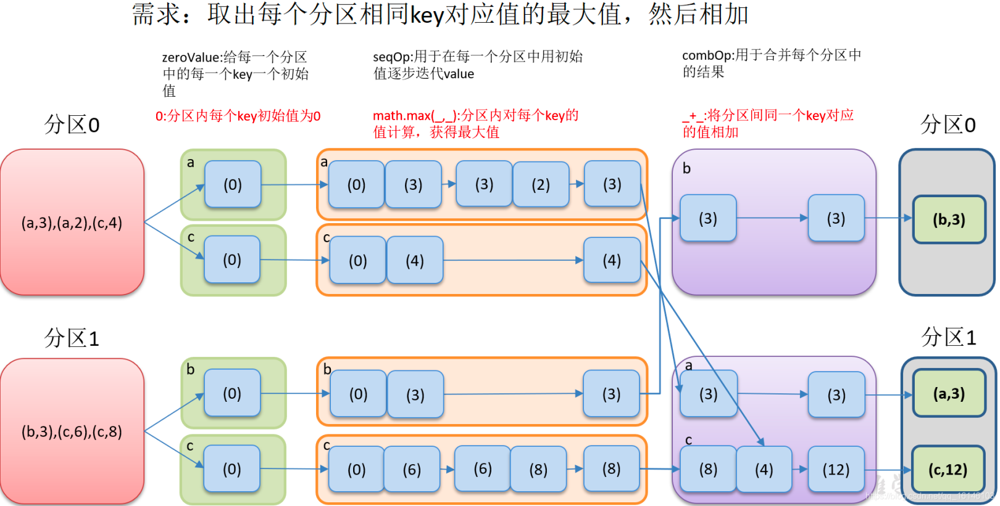

         ```scala
             val rdd: RDD[(String, Int)] = sc.makeRDD(List(
              ("a", 1), ("a", 2), ("b", 3),
              ("b", 4), ("b", 5), ("a", 6)
            ), 2)


            val aggRDD: RDD[(String, Int)] = rdd.aggregateByKey(0)(
              (x, y) => math.max(x, y),
              (x, y) => (x + y)
            )
            //(b,8),(a,8)
         ```
  - 分区内和分区间也可以进行相同的逻辑操作，且可以使用Scala的至简原则进行简化
   
       ```scala
        val aggRDD: RDD[(String, Int)] = rdd.aggregateByKey(0)(
          (x, y) => (x + y),
          (x, y) => (x + y)
        )
        val aggRDD: RDD[(String, Int)] = rdd.aggregateByKey(0)(_+_,_+_)
      ```
  
  - 获取相同key的数据的value的平均值
      
    ```scala
        val rdd: RDD[(String, Int)] = sc.makeRDD(List(
          ("a", 1), ("a", 2), ("b", 3),
          ("b", 4), ("b", 5), ("a", 6)
        ), 2)

        val aggregateRDD: RDD[(String, (Int, Int))] = rdd.aggregateByKey((0, 0))(
          (t, v) => {
            (t._1 + v, t._2 + 1)
          },
          (t1, t2) => {
            (t1._1 + t2._1, t1._2 + t2._2)
          }
        )

        val resultRDD: RDD[(String, Int)] = aggregateRDD.mapValues {
          case (num, cnt) => {
            num / cnt
          }
        }
        /* 
           (b,4)
          (a,3)
        * /
     ```

  5. foldByKey
   - 功能
       
      分区内和分区间也可以进行相同的逻辑操作
  
   - 代码
     ```scala
     val rdd: RDD[(String, Int)] = sc.makeRDD(List(
        ("a", 1), ("a", 2), ("b", 3),
        ("b", 4), ("b", 5), ("a", 6)
      ), 2)
  
        rdd.foldByKey(0)(_ + _).collect().foreach(println)
       // (b,12)
       //  (a,9)
      ```
 
   6. combineByKey
   - 功能
       ```combineByKey[C](
         createCombiner: V => C,
         mergeValue: (C, V) => C,
         mergeCombiners: (C, C) => C)
       ```
       * 第一个参数表示：将相同的key的第一个数据进行结构的转换，实现操作
       * 第二个参数表示：分区内的计算规则
       * 第三个参数表示：分区间的计算规则
  
     - 代码
      - 获取相同key的数据的value的平均值
         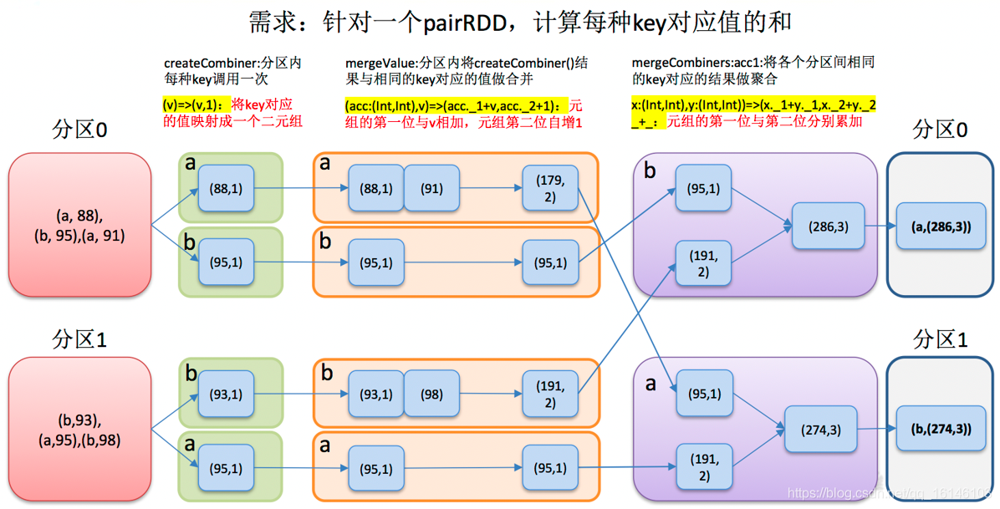
      ```scala
     val rdd: RDD[(String, Int)] = sc.makeRDD(List(
       ("a", 1), ("a", 2), ("b", 3),
       ("b", 4), ("b", 5), ("a", 6)
     ), 2)

       val combineRDD: RDD[(String, (Int, Int))] = rdd.combineByKey(
         v => (v, 1),
         (t: (Int, Int), v) => { //这里的t就是上面的(v,1)代表的元组（相同的key的第一个数据转换结构之后的），v就是相同key但除了第一个元组的v
           (t._1 + v, t._2 + 1)
         },
         (t1: (Int, Int), t2: (Int, Int)) => {
           (t1._1 + t2._1, t1._2 + t2._2)
         }
       )

       val resultRDD: RDD[(String, Int)] = combineRDD.mapValues {
         case (num, cnt) => {
           num / cnt
         }
       }
      ```
   7. 聚合算子比较
   - 源码
   
      ```scala
        reduceByKey:
          combineByKeyWithClassTag[V](
            (v: V) => v,    //第一个值不参与运算
            func,           //分区内计算规则
            func            //分区间计算规则
          )
        aggregateByKey:
          combineByKeyWithClassTag[U](
            (v: V) => cleanedSeqOp(createZero(), v),//初始值和第一个key的value值进行的分区内数据操作
            cleanedSeqOp,   //分区内计算规则
            combOp,         //分区间计算规则
          )
        foldByKey:
          combineByKeyWithClassTag[V](
            (v: V) => cleanedFunc(createZero(), v),//初始值和第一个key的value值进行的分区内数据操作
            cleanedFunc,  //分区内计算规则
            cleanedFunc,  //分区间计算规则
          )
        combineByKey:
          combineByKeyWithClassTag(
            createCombiner, //相同key的第一条数据进行的处理函数
            mergeValue,     //表示分区内数据的处理函数
            mergeCombiners  //表示分区间数据的处理函数
            )
      ```

   - 代码
  
      ```scala
        rdd.reduceByKey(_ + _)
        rdd.foldByKey(0)(_ + _)
        rdd.aggregateByKey(0)(_ + _, _ + _)
        rdd.combineByKey(v => v, (x: Int, y: Int) => x + y, (x: Int, y: Int) => x + y)
      ```
    
   8. join[外连接]
    - 功能
       
      两个不同的数据源，相同的key的value会连接在一起，形成元组

   - 代码
      ```scala
       import org.apache.spark.rdd.RDD
       import org.apache.spark.{SparkConf, SparkContext}
      
       object join {
        def main(args: Array[String]): Unit = {
          val sparkConf: SparkConf = new SparkConf().setMaster("local[*]").setAppName("Operator")
          val sc = new SparkContext(sparkConf)
      
          // TODO 算子 —— Key-Value 类型 —— join
          val rdd1: RDD[(String, Int)] = sc.makeRDD(List(("a", 1), ("b", 2), ("c", 3), ("d", 1)))
          val rdd2: RDD[(String, Int)] = sc.makeRDD(List(("c", 4), ("b", 5), ("a", 6)))
      
          //     如果这两个数据源中有的key匹配不上，那么数据将不会出现在结果中
          //     如果两个数据源中key有多个相同的，那么会依次匹配，可能会出现笛卡尔乘积，数据量会几何性增长，会导致性能降低
          val joinRDD: RDD[(String, (Int, Int))] = rdd1.join(rdd2)
      
          joinRDD.collect().foreach(println)
          sc.stop()
        }
       }
      /*
        (a,(1,6))
        (b,(2,5))
        (c,(3,4))
      */
      ```
   - leftOuterJoin & rightOuterJoin
        ```scala
         // TODO 算子 —— Key-Value 类型 —— leftOuterJoin & rightOuterJoin
          val rdd1: RDD[(String, Int)] = sc.makeRDD(List(("a", 1), ("b", 2), ("c", 3)))
          val rdd2: RDD[(String, Int)] = sc.makeRDD(List(("b", 5), ("a", 6)))
    
          val rdd3: RDD[(String, Int)] = sc.makeRDD(List(("a", 1), ("b", 2)))
          val rdd4: RDD[(String, Int)] = sc.makeRDD(List(("b", 5), ("a", 6), ("c", 4)))
    
          //     如果这两个数据源中有的key匹配不上，那么数据将不会出现在结果中
          //     如果两个数据源中key有多个相同的，那么会依次匹配，可能会出现笛卡尔乘积，数据量会几何性增长，会导致性能降低
          val leftJoinRDD: RDD[(String, (Int, Option[Int]))] = rdd1.leftOuterJoin(rdd2)
    
          leftJoinRDD.collect().foreach(println)
          /*
            (a,(1,Some(6)))
            (b,(2,Some(5)))
            (c,(3,None))
           */
          val rightJoinRDD: RDD[(String, (Option[Int], Int))] = rdd3.rightOuterJoin(rdd4)
          rightJoinRDD.collect().foreach(println)
          /*
            (a,(Some(1),6))
            (b,(Some(2),5))
            (c,(None,4))
          */
         ```
   9. cogroup : connect + group（分组，连接）
         
   ```scala
     object cogroup {
   def main(args: Array[String]): Unit = {
        val sparkConf: SparkConf = new SparkConf().setMaster("local[*]").setAppName("Operator")
        val sc = new SparkContext(sparkConf)
    
     // TODO 算子 —— Key-Value 类型 —— cogroup
     val rdd1: RDD[(String, Int)] = sc.makeRDD(List(("a", 1), ("b", 2), ("c", 3)))
     val rdd2: RDD[(String, Int)] = sc.makeRDD(List(("b", 5), ("a", 6)))
     //cogroup: connect + group（分组，连接）
     val cgRDD: RDD[(String, (Iterable[Int], Iterable[Int]))] = rdd1.cogroup(rdd2)
    
     cgRDD.collect().foreach(println)
     sc.stop()
   }
    }
    /*
    (a,(CompactBuffer(1),CompactBuffer(6)))
    (b,(CompactBuffer(2),CompactBuffer(5)))
    (c,(CompactBuffer(3),CompactBuffer()))
    */
   ```
6. 案例
  ```scala
    import org.apache.spark.{SparkConf, SparkContext}
    import org.apache.spark.rdd.RDD
    
    // 每个省份每个广告top3
    
    object Req {
      def main(args: Array[String]): Unit = {
        val sparkConf: SparkConf = new SparkConf().setMaster("local[*]").setAppName("Operator")
        val sc = new SparkContext(sparkConf)
    
        // TODO 算子 —— 案例实操
        //1.获取原始数据：时间戳，省份，城市，用户，广告
        val inputRDD: RDD[String] = sc.textFile("datas/agent.log")
        //2.将原始的数据进行结构的转换，方便统计。
        //时间戳，省份，城市，用户，广告 => ((省份，广告)，1)
        val proAndAdRDD: RDD[((String, String), Int)] = inputRDD.map(
          (line: String) => {
            val fields: Array[String] = line.split(" ")
            val pro: String = fields(1)
            val ad: String = fields(4)
            ((pro, ad), 1)
          }
        )
    
        //3.将转换结构后的数据进行分组聚合
        //((省份，广告)，1) => ((省份，广告)，sum)
        val sumRDD: RDD[((String, String), Int)] = proAndAdRDD.reduceByKey((i1: Int, i2: Int) => {
          i1 + i2
        })
        //4.将聚合的结果进行结构的转换
        //((省份，广告)，sum) => (省份，(广告，sum))
        val transformRDD: RDD[(String, (String, Int))] = sumRDD.map(
          (t: ((String, String), Int)) => {
            (t._1._1, (t._1._2, t._2))
          }
        )
    
        //5.将转换结构后的数据根据省份进行分组
        //(省份，[(广告A，sumA),(广告B，sumB),(广告C，sumC),])
        val groupRDD: RDD[(String, Iterable[(String, Int)])] = transformRDD.groupByKey()
        //6.将分组后的数据降序排列，取前三名
        val resRDD: RDD[(String, List[(String, Int)])] = groupRDD.mapValues(
          (iter: Iterable[(String, Int)]) => {
            iter.toList.sortBy((t: (String, Int)) => t._2)(Ordering.Int.reverse).take(3)
          }
        )
        //7.采集数据打印在控制台
        resRDD.collect().foreach(println)
        //8.关闭环境
        sc.stop()
      }
    }

  ```

## 4.2. Action

 * 触发作业的执行 
 * 底层代码调用的是环境对象的runJob方法
 * 底层代码会创建ActiveJob，并提交执行

 1. reduce
 2. collect
   
    `方法会将不同分区的数据按照分区顺序采集到Driver端的内存中，形成数组`
 3. count
 4. first
 5. take
   
    `获取前N个数据`
 6. takeOrdered
    
     `数据排序后，取前N个数据`
 7. aggregate 分区间初始值
 - aggregateByKey vs aggregate
   * aggregateByKey：初始值只会参与分区内的计算  13 + 17 = 30
   * aggregate：初始值不仅会参与分区内的计算，还参与分区间的计算  13 + 17 + 10 = 40
 8. fold
  
  `当aggregate分区间和分区内规则一致时，可以采用fold进行简化`

 9. foreach 
  ```scala
  val rdd: RDD[(String, Int)] = sc.makeRDD(List(
      ("a", 1), ("a", 2), ("a", 3)
    ))
    //此处的foreach其实是各个Executor端的数据收集到Driver端内存集合的循环遍历方法
    rdd.collect().foreach(println)

    println("-------------------")
    //此处的foreach其实是Executor端内存数据的打印
    rdd.foreach(println)
    /*
    (a,1)
    (a,2)
    (a,3)
    -------------------
    (a,2)
    (a,1)
    (a,3)
    */
 ```

 10. countByKey & countByValue
   ```scala
    val rdd: RDD[Int] = sc.makeRDD(List(1, 1, 1, 4),2)
    val rdd1: RDD[(String, Int)] = sc.makeRDD(List(
      ("a", 1), ("a", 2), ("a", 3)
    ))
    //TODO 行动算子 - countByValue & countByKey

    val intToLong: collection.Map[Int, Long] = rdd.countByValue() //Map(4 -> 1, 1 -> 3)
    println(intToLong)

    val stringToLong: collection.Map[String, Long] = rdd1.countByKey() //Map(a -> 3)
    println(stringToLong) 
  ```
 11. save & saveAsTextFile & saveAsObjectFile & saveAsSequenceFile
     - saveAsSequenceFile方法要求数据的格式必须为K-V类型
     

  - 例子1
```scala
import org.apache.spark.rdd.RDD
import org.apache.spark.{SparkConf, SparkContext}

object reduce {
  def main(args: Array[String]): Unit = {
    val sparkConf: SparkConf = new SparkConf().setMaster("local[*]").setAppName("Operator")
    val sc = new SparkContext(sparkConf)

    val rdd: RDD[Int] = sc.makeRDD(List(1, 2, 3, 4))
    //TODO 行动算子

    //reduce
    val res: Int = rdd.reduce(_ + _)
    println(res)

    //collect
    //方法会将不同分区的数据按照分区顺序采集到Driver端的内存中，形成数组
    val array: Array[Int] = rdd.collect()
    println(array.mkString(","))

    //count:数据源中数据的个数
    val cnt: Long = rdd.count()
    println(cnt)

    //first:获取数据源中数据的第一个
    val first: Int = rdd.first()
    println(first)

    //take:获取前N个数据
    val take: Array[Int] = rdd.take(3)
    println(take.mkString(","))

    //takeOrdered:数据排序后，取前N个数据
    val rdd1: RDD[Int] = sc.makeRDD(List(4, 2, 3, 1))
    val takeOrdered: Array[Int] = rdd1.takeOrdered(3)(Ordering.Int.reverse) //降序
    println(takeOrdered.mkString(","))

    sc.stop()
  }
}
```
 - 例子2
```scala
    val rdd: RDD[Int] = sc.makeRDD(List(1, 2, 3, 4), 2)
    //TODO 行动算子

    //val res: Int = rdd.aggregate(0)(_ + _, _ + _)

    //aggregateByKey：初始值只会参与分区内的计算  13 + 17 = 30
    //aggregate：初始值不仅会参与分区内的计算，还参与分区间的计算  13 + 17 + 10 = 40
    val res: Int = rdd.aggregate(10)(_ + _, _ + _)
    println(res)

    //fold:当aggregate分区间和分区内规则一致时，可以采用fold进行简化
    val i: Int = rdd.fold(10)(_ + _)
    println(i)
   ```

# 5. RDD依赖关系

 * RDD不会保存数据， 为了容错。保存RDD血缘关系，将数据源重新读取进行计算
 * rddxx.toDebugString 血缘关系
 * rddxx.dependencies 依赖关系
    ```shell
   List(org.apache.spark.OneToOneDependency@29138d3a)
    *****************************
    List(org.apache.spark.OneToOneDependency@10afe71a)
    *****************************
    List(org.apache.spark.OneToOneDependency@9fc9f91)
    *****************************
    List(org.apache.spark.ShuffleDependency@135a8c6f)
 
   ```


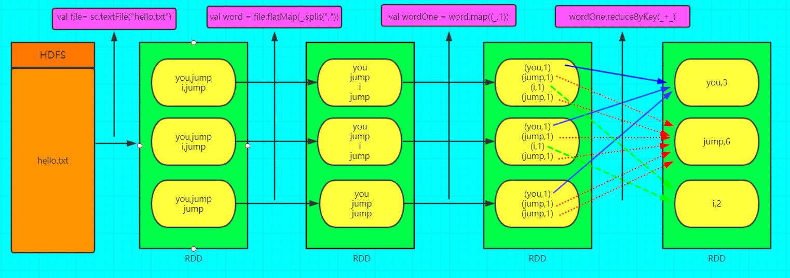
## 5.1. 宽依赖
   
   `Shuffle， 多生 `
   - 包含Shuffle过程，无法实现流水线方式处理
   - 父 RDD 的分区被不止一个子 RDD 的分区依赖
   - 具有宽依赖的 transformations 包括: sort, reduceByKey, groupByKey, join, 和调用rePartition函数的任何操作.
   - task 数量增加，分stage
   - 需要等待
## 5.2. 窄依赖

` 一对一，独生 `
 - 可以实现流水线优化
 - 父 RDD 中的每个分区最多只有一个子分区, 形象的比喻为独生子女
 - 可以在任何的的一个分区上单独执行, 而不需要其他分区的任何信息.

## 5.3 总结

`shuffle` 操作是 spark 中最耗时的操作,应尽量避免不必要的 `shuffle`.

# 6. 任务划分
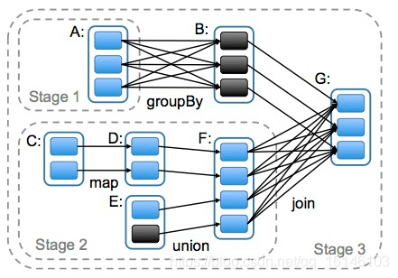

划分stage的依据就是RDD之间的宽窄依赖

Spark任务会根据RDD之间的依赖关系，形成一个DAG有向无环图，DAG会提交给DAGScheduler，
DAGScheduler会把DAG划分成互相依赖的多个stage。

核心算法：回溯算法 从后往前回溯/反向解析，遇到窄依赖加入本Stage，遇见宽依赖进行Stage切分。


## 6.1 stage划分
- 对于窄依赖，partition的转换处理在Stage中完成计算。
- 对于宽依赖，由于有Shuffle的存在，只能在parent RDD处理完成后，才能开始接下来的计算，因此宽依赖是划分Stage的依据。

## 6.2 DAG&job&Action&分区&关系
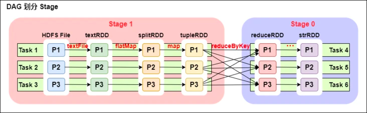


* 概念
  - Application 初始化一个SparkContext即生成一个Application
  - job  执行一个Action操作，就会执行sc.runJob(...)
  - stages  宽依赖 + 1
  - tasks 
    - 一个Stage阶段中，最后一个RDD的分区个数就是Task的个数 
    - 最小执行单位  一个分区划一个Task, 每一个 task 表现为一个本地计算

* 联系⚠️
  - Application->Job->Stage->Task 1对n
  - 有几个Action，就有几个DAG,一个程序可有多个DAG
  - 一个DAG可以有多个Stage【根据宽依赖/shuffle进行划分】
  - 同一个Stage可以有多个Task并行执行(task数=分区数，如上图，Stage1 中有三个分区P1、P2、P3，对应的也有三个 Task)


# 7. 持久化
- 适用场景
  - RDD重复使用
  - 执行时间长，或重要
  
- RDD不存储数据，如果RDD重复使用，则从头再执行获取数据

  - 实例

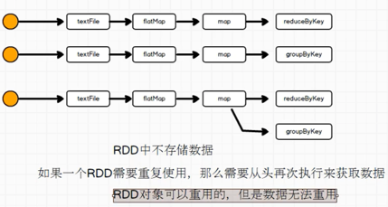

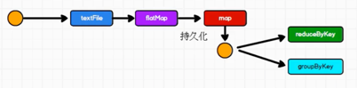
```scala
    val list = List("Hello Spark", "Hello Scala")

    val rdd: RDD[String] = sc.makeRDD(list)

    val flatRDD: RDD[String] = rdd.flatMap(str => str.split(" "))

    val mapRDD: RDD[(String, Int)] = flatRDD.map((_, 1))

    val resRDD: RDD[(String, Int)] = mapRDD.reduceByKey(_ + _)

    resRDD.collect().foreach(println)

    println("--------------------")

    val resRDD1: RDD[(String, Iterable[Int])] = mapRDD.groupByKey()

    resRDD1.collect().foreach(println)
```

7.1 persist与cache
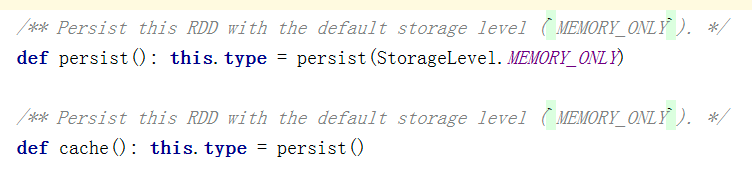


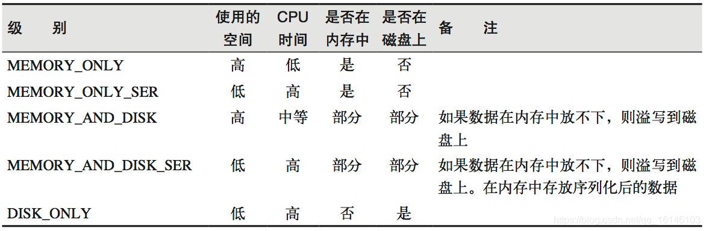
7.2 checkpoint
- 需要落盘，需指定检查点保存路径
- 检查点路径保存的文件，当作业执行完毕，不会被删除
- 一般保存在分布式存储系统，如HDFS

7.3 cache vs persist vs checkpoint
 * `cache`:将数据临时存储在内存中进行数据重用
   * 会在血缘关系中添加新的依赖
 * `persist`：将数据临时存储在磁盘文件中进行数据重用
   * 设计到磁盘IO，性能较低，但是数据安全
   * 如果作业执行完毕，临时保存的数据文件就会丢失
   * 会在血缘关系中添加新的依赖
 * `checkpoint`：将数据长久地保存在磁盘文件中进行数据重用
   * 涉及到磁盘IO，性能较低，但是数据安全
   * 为了保证数据安全，所以一般情况下，会独立执行作业
   * 为了提高效率，一般会和cache方法联合使用
   * 执行过程中，切断血缘关系，建立新的血缘关系
   * 等同于改变数据源

 - checkpoint 独立执行作业实例
```scala
object persist3 {
  def main(args: Array[String]): Unit = {
    // 创建 Spark 运行配置对象
    val sparkConf: SparkConf = new SparkConf().setMaster("local").setAppName("Persist")
    // 创建 Spark 上下文环境对象（连接对象）
    val sc = new SparkContext(sparkConf)
    sc.setCheckpointDir("checkpointDir")

    val list = List("Hello Spark", "Hello Scala")

    val rdd: RDD[String] = sc.makeRDD(list)

    val flatRDD: RDD[String] = rdd.flatMap(str => str.split(" "))

    val mapRDD: RDD[(String, Int)] = flatRDD.map(word => {
      println("================");
      (word, 1)
    }
    )
//    mapRDD.cache() // 加上cache 减少独立作业
    mapRDD.checkpoint()

    val resRDD: RDD[(String, Int)] = mapRDD.reduceByKey(_ + _)

    resRDD.collect().foreach(println)

    println("--------------------")

    val resRDD1: RDD[(String, Iterable[Int])] = mapRDD.groupByKey()

    resRDD1.collect().foreach(println)

    sc.stop()
  }
}
/*
================
================
================
================
================
================
================
================
(Spark,1)
(Hello,2)
(Scala,1)
--------------------
(Spark,CompactBuffer(1))
(Hello,CompactBuffer(1, 1))
(Scala,CompactBuffer(1))

*/
```

## 8. 序列化
- 序列化问题：

  - 闭包检测
    * 算子以外的代码在driver执行，算子里代码在excutor执行
    * 算子内经常用到算子外的数据，形成闭包效果 。当RDD算子中传递的函数是包含闭包操作，那么就会进行检测功能
    * 类的构造参数其实是类的属性, 构造参数需要进行闭包检测，其实就等同于类进行闭包检测
   

  - 例子1 算子闭包检测

   User 在网络中传递，driver创建，excuter计算

   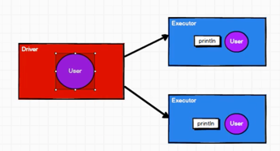

```scala
package spark.core.rdd.action

import org.apache.spark.rdd.RDD
import org.apache.spark.{SparkConf, SparkContext}

object foreach_1 {
  def main(args: Array[String]): Unit = {
    val sparkConf: SparkConf = new SparkConf().setMaster("local[*]").setAppName("Operator")
    val sc = new SparkContext(sparkConf)

    //val rdd: RDD[Int] = sc.makeRDD(List(1, 2, 3, 4))
    val rdd: RDD[Int] = sc.makeRDD(List())

    val user = new User
    //SparkException: Task not serializable
    //NotSerializableException: com.ustb.ly.spark.core.rdd.operator.action.Spark07_RDD_Operator_Action$User

    //RDD算子中传递的函数是包含闭包操作，那么就会进行检测功能
    //闭包检测功能
    rdd.foreach(num => {
      println(user.age + num)
    })
    sc.stop()
  }

  //class User extends Serializable {   ------ 正确方法
  //样例类在编译时，会自动混入序列化特质（实现可序列化接口）
  //case class User() {                 ------ 正确方法
  class User {                          ------ 错误方法
    var age: Int = 30
  }

} 
```
   - 例子2  类的构造参数
```scala
// getMatch1 报错  getMatch2 正确
    
import org.apache.spark.{SparkConf, SparkContext}
import org.apache.spark.rdd.RDD

object Serial {
  def main(args: Array[String]): Unit = {
    val sparkConf = new SparkConf().setMaster("local").setAppName("Serial")
    val sc = new SparkContext(sparkConf)

    val rdd: RDD[String] = sc.makeRDD(Array("hello world", "hello spark", "hive", "atguigu"))

    val search = new Search("h")

    //search.getMatch1(rdd).collect().foreach(println)
    search.getMatch2(rdd).collect().foreach(println)

    sc.stop()
  }
  // 查询对象
  // 类的构造参数其实是类的属性, 构造参数需要进行闭包检测，其实就等同于类进行闭包检测
  class Search(query: String) {

    def isMatch(s: String): Boolean = {
      s.contains(this.query)
    }

    // 函数序列化案例
    def getMatch1(rdd: RDD[String]): RDD[String] = {
      rdd.filter(isMatch)
    }

    // 属性序列化案例
    def getMatch2(rdd: RDD[String]): RDD[String] = {
      val s = query // s是字符串
      rdd.filter(x => x.contains(s))
    }
  }

}

```


- Kryo 序列化框架

## 9. RDD分区

## 10. 参考资料

- [尚硅谷大数据Spark教程从入门到精通](https://www.bilibili.com/video/BV11A411L7CK) 📚

