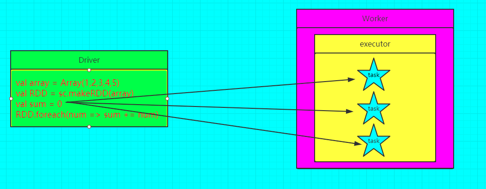
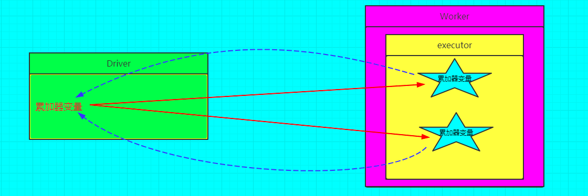
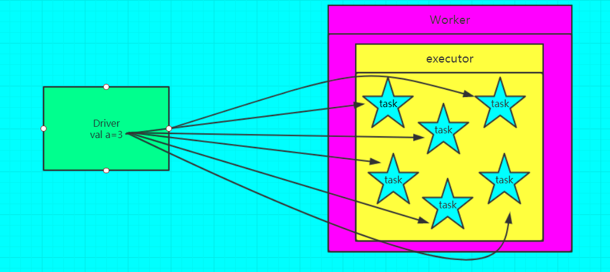
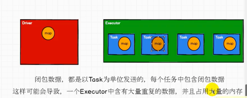
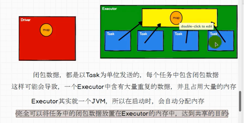

# 📖 spark
- [spark基础](#spark基础)
    - [架构设计](架构.md#架构设计)
    - [运行模式](架构.md#运行模式)
        - [local](架构.md#local)
        - [standalone](架构.md#standalone)
        - [yarn](架构.md#yarn)
    - [环境搭建](架构.md#环境搭建)
    - [基础概念](架构.md#基础概念)
    - [任务基本流程](架构.md#任务基本流程)
    - [参考资料](架构.md#参考资料)
- [RDD基础](#RDD基础)
    - [常用RDD算子](RDD/README.md)
    - [累加器](#累加器)
        - [累加器注意问题](#累加器注意问题)
        - [自定义累加器](#自定义累加器)
    - [广播变量](#广播变量)
        - [实例](#实例)
  - [开发调优篇](spark开发调优篇.md)
  - [资源调优篇](spark资源调优篇.md)
    - [JVM的基本架构](https://www.cnblogs.com/qingyunzong/p/8973748.html)
    - [JVM的GC垃圾收集器](https://www.cnblogs.com/qingyunzong/p/8973857.html)
  - [数据倾斜调优](数据倾斜调优.md#数据倾斜调优)
    - [某个task执行特别慢的情况](数据倾斜调优.md#某个task执行特别慢的情况)
    - [解决方案](数据倾斜调优.md#解决方案)
  - [Shuffle调优](https://www.cnblogs.com/qingyunzong/p/8954552.html)
  - [Spark内存模型](https://www.cnblogs.com/qingyunzong/p/8955141.html)
- [参考资料](#参考资料)

# RDD基础

## 累加器

```longAccumulator``` 分布式共享只写变量

- 无累加器

- 加累加器


### 注意事项
- 累加器在Driver端定义赋初始值，累加器只能在Driver端读取最后的值，在Excutor端更新。
- 累加器不是一个调优的操作，因为如果不这样做，结果是错的

### 累加器注意问题

- 注意⚠️
    - 少加：转换算子中调用累加器，如果没有调用行动算子的话，那么会出现少加的情况
    - 多加：转换算子中调用累加器，如果多次调用行动算子，那么会出现多加的情况
    - 一般情况下，累加器会放在`行动算子`中进行操作
- 实例
    - 未用累加器版本
      ```scala
      val rdd = sc.makeRDD(List(1, 2, 3, 4))
    
          //reduce:分区内计算，分区间计算
      //    val res: Int = rdd.reduce(_ + _)
      //    println(res)
    
          var sum = 0
          rdd.foreach(
            num=> sum = sum + num
          )
          println(sum)
      // sum=0 因为分区，每个分区sum初始值为0
      ```

    - 累加器重写版本
      ```scala
      import org.apache.spark.util.LongAccumulator
      import org.apache.spark.{SparkConf, SparkContext}

      object Spark02_Acc {
        def main(args: Array[String]): Unit = {
    
          val sparkConf: SparkConf = new SparkConf().setMaster("local").setAppName("Acc")
          val sc = new SparkContext(sparkConf)
    
          val rdd = sc.makeRDD(List(1, 2, 3, 4))
          //获取系统累加器
          //Spark默认就提供了简单数据聚合的累加器
          val sumAcc: LongAccumulator = sc.longAccumulator("sum")
    
          //sc.doubleAccumulator()
          //sc.collectionAccumulator()
    
          rdd.foreach(
            num => {
              //使用累加器
              sumAcc.add(num)
            }
          )
    
          println(sumAcc.value)
    
          sc.stop()
        }
      }
      ```
    - 少加或多加
      ```scala
      val rdd = sc.makeRDD(List(1, 2, 3, 4))
      val sumAcc: LongAccumulator = sc.longAccumulator("sum")

      val mapRDD = rdd.map(
        num => {
          //使用累加器
          sumAcc.add(num)
        }
      )

      //获取累加器的值
      //少加：转换算子中调用累加器，如果没有调用行动算子的话，那么会出现少加的情况
      //多加：转换算子中调用累加器，如果多次调用行动算子，那么会出现多加的情况
      //一般情况下，累加器会放在行动算子中进行操作
      mapRDD.collect()
      mapRDD.collect()
      println(sumAcc.value)
      ```

### 自定义累加器

- 实例 wordCount

   ```scala
    import org.apache.spark.util.{AccumulatorV2, LongAccumulator}
    import org.apache.spark.{SparkConf, SparkContext}
    
    import scala.collection.mutable
    
    object Spark04_Acc_WordCount {
      def main(args: Array[String]): Unit = {
    
        val sparkConf: SparkConf = new SparkConf().setMaster("local").setAppName("Acc")
        val sc = new SparkContext(sparkConf)
    
        val rdd = sc.makeRDD(List("hello", "world", "hello"))
        //累加器：WordCount
        //创建累加器对象
        val wcAcc = new MyAccumulator()
        //向spark进行注册
        sc.register(wcAcc, "WordCountAcc")
    
        rdd.foreach(
          word => {
            //数据的累加（使用累加器）
            wcAcc.add(word)
          }
        )
    
        //获取累加器的结果
        println(wcAcc.value)
        sc.stop()
      }
    
      /*
        自定义数据累加器：WordCount
          1.继承自AccumulatorV2，定义泛型
            IN：累加器输入的数据类型：String
            OUT：累加器输出的数据类型：mutable.Map[String, Long]
          2.重写方法(6个)
       */
      class MyAccumulator extends AccumulatorV2[String, mutable.Map[String, Long]] {
    
        private var wcMap = mutable.Map[String, Long]()
    
        //判断是否为初始状态
        override def isZero: Boolean = {
          wcMap.isEmpty
        }
    
        override def copy(): AccumulatorV2[String, mutable.Map[String, Long]] = {
          new MyAccumulator()
        }
    
        //重置累加器
        override def reset(): Unit = {
          wcMap.clear()
        }
    
        //获取累加器需要计算的值
        override def add(word: String): Unit = {
          val newCnt = wcMap.getOrElse(word, 0L) + 1
          wcMap.update(word, newCnt)
        }
    
        //Driver合并多个累加器
        override def merge(other: AccumulatorV2[String, mutable.Map[String, Long]]): Unit = {
          val map1 = this.wcMap
          val map2 = other.value
    
          map2.foreach {
            case (word, count) => {
              val newCount = map1.getOrElse(word, 0L) + count
              map1.update(word, newCount)
            }
          }
        }
    
        //累加器结果
        override def value: mutable.Map[String, Long] = {
          wcMap
        }
      }
    
    }
  
   ```

## 广播变量
` 分布式共享只读变量 `

- 不使用广播变量

- 使用广播变量的情况


### 注意事项
- 能不能将一个RDD使用广播变量广播出去？

  不能，因为RDD是不存储数据的。可以将RDD的结果广播出去。
- 广播变量只能在Driver端定义，不能在Executor端定义。
- 在Driver端可以修改广播变量的值，在Executor端无法修改广播变量的值。
- 如果executor端用到了Driver的变量，如果不使用广播变量在Executor有多少task就有多少Driver端的变量副本。
- 如果Executor端用到了Driver的变量，如果使用广播变量在每个Executor中只有一份Driver端的变量副本。

### 实例

- 未加广播变量
    ```scala
    val rdd1 = sc.makeRDD(List(
     ("a", 1),
     ("b", 2),
     ("c", 3)
   ))

   val rdd2 = sc.makeRDD(List(
     ("a", 4),
     ("b", 5),
     ("c", 6)
   ))

   //join会导致数据量几何增长，并且会影响shuffle的性能，不推荐使用
   val joinRDD: RDD[(String, (Int, Int))] = rdd1.join(rdd2)
   joinRDD.collect().foreach(println)
   /*
     (a,(1,4))
     (b,(2,5))
     (c,(3,6))
   */
   ```

- 无join版本[数据量大时，性能不好]



   ```scala
   val rdd1 = sc.makeRDD(List(
     ("a", 1),
     ("b", 2),
     ("c", 3)
   ))
    
   val map: mutable.Map[String, Int] = mutable.Map(("a", 4), ("b", 5), ("c", 6))
   rdd1.map {
     case (w, c) => {
       val i: Int = map.getOrElse(w, 0)
       (w, (c, i))
     }
   }.collect().foreach(println)
   ```

- 广播变量



   ```scala
    val rdd1 = sc.makeRDD(List(
      ("a", 1),
      ("b", 2),
      ("c", 3)
    ))


    val map: mutable.Map[String, Int] = mutable.Map(("a", 4), ("b", 5), ("c", 6))

    //封装广播变量
    val bc: Broadcast[mutable.Map[String, Int]] = sc.broadcast(map)

    rdd1.map {
      case (w, c) => {
        //访问广播变量
        val i: Int = bc.value.getOrElse(w, 0)
        (w, (c, i))
      }
    }.collect().foreach(println)
  ```


# 参考资料
- [Spark性能优化指南——高级篇](https://tech.meituan.com/2016/05/12/spark-tuning-pro.html) 📚
- [Spark性能优化指南——基础篇](https://tech.meituan.com/2016/04/29/spark-tuning-basic.html) 📚
- [Spark学习之路 （八）SparkCore的调优之开发调优](https://www.cnblogs.com/qingyunzong/p/8946637.html#_label10)
- [Spark性能调优实战](https://time.geekbang.org/column/intro/100073401)
- [Spark性能调优实战_xiewenbo](https://www.cxyzjd.com/article/xiewenbo/50041613)
- https://changbo.tech/blog/19c2ab93.html