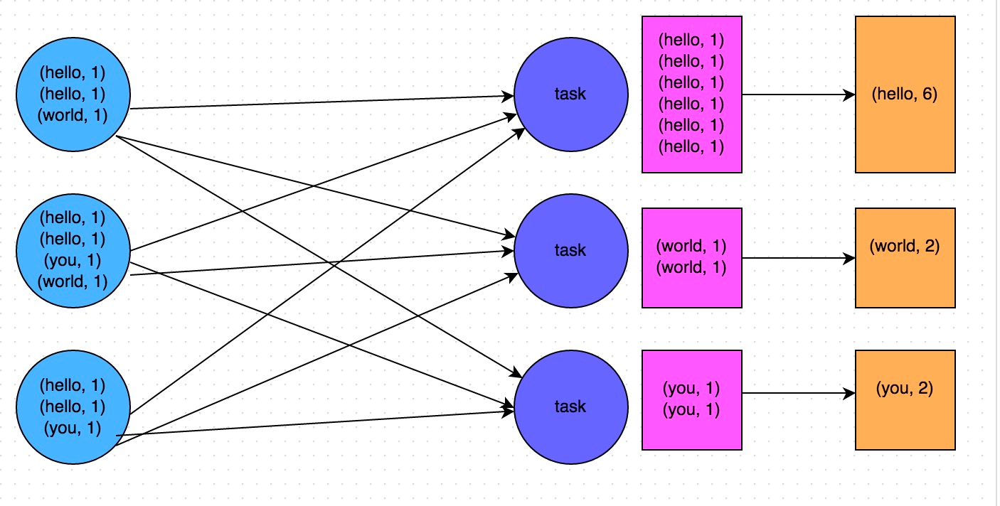
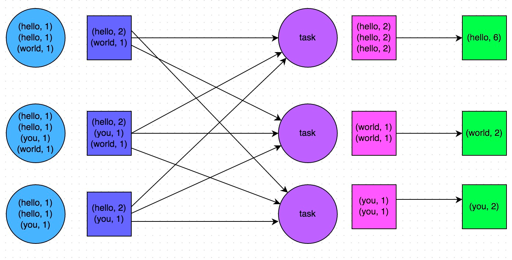

# 📖 开发调优篇
## 1. RDD效率
   - 同一份数据，创建同一个RDD
   - 尽可能复用同一个RDD
   - 对多次使用的RDD进行持久化
     - 调用cache()和persist()即可
    ```scala
    // 需要对名为“hello.txt”的HDFS文件进行一次map操作，再进行一次reduce操作。也就是说，需要对一份数据执行两次算子操作。
    
    // 错误的做法：对于同一份数据执行多次算子操作时，创建多个RDD。
    // 这里执行了两次textFile方法，针对同一个HDFS文件，创建了两个RDD出来，然后分别对每个RDD都执行了一个算子操作。
    // 这种情况下，Spark需要从HDFS上两次加载hello.txt文件的内容，并创建两个单独的RDD；第二次加载HDFS文件以及创建RDD的性能开销，很明显是白白浪费掉的。
    val rdd1 = sc.textFile("hdfs://192.168.0.1:9000/hello.txt")
    rdd1.map(...)
    val rdd2 = sc.textFile("hdfs://192.168.0.1:9000/hello.txt")
    rdd2.reduce(...)
    
    // 正确的用法：对于一份数据执行多次算子操作时，只使用一个RDD。
    // 这种写法很明显比上一种写法要好多了，因为我们对于同一份数据只创建了一个RDD，然后对这一个RDD执行了多次算子操作。
    // 但是要注意到这里为止优化还没有结束，由于rdd1被执行了两次算子操作，第二次执行reduce操作的时候，还会再次从源头处重新计算一次rdd1的数据，因此还是会有重复计算的性能开销。
    // 要彻底解决这个问题，必须结合“原则三：对多次使用的RDD进行持久化”，才能保证一个RDD被多次使用时只被计算一次。
    val rdd1 = sc.textFile("hdfs://192.168.0.1:9000/hello.txt")
    rdd1.map(...)
    rdd1.reduce(...)
     ```

```scala
// 如果要对一个RDD进行持久化，只要对这个RDD调用cache()和persist()即可。

// 正确的做法。
// cache()方法表示：使用非序列化的方式将RDD中的数据全部尝试持久化到内存中。
// 此时再对rdd1执行两次算子操作时，只有在第一次执行map算子时，才会将这个rdd1从源头处计算一次。
// 第二次执行reduce算子时，就会直接从内存中提取数据进行计算，不会重复计算一个rdd。
val rdd1 = sc.textFile("hdfs://192.168.0.1:9000/hello.txt").cache()
rdd1.map(...)
rdd1.reduce(...)

// persist()方法表示：手动选择持久化级别，并使用指定的方式进行持久化。
// 比如说，StorageLevel.MEMORY_AND_DISK_SER表示，内存充足时优先持久化到内存中，内存不充足时持久化到磁盘文件中。
// 而且其中的_SER后缀表示，使用序列化的方式来保存RDD数据，此时RDD中的每个partition都会序列化成一个大的字节数组，然后再持久化到内存或磁盘中。
// 序列化的方式可以减少持久化的数据对内存/磁盘的占用量，进而避免内存被持久化数据占用过多，从而发生频繁GC。
val rdd1 = sc.textFile("hdfs://192.168.0.1:9000/hello.txt").persist(StorageLevel.MEMORY_AND_DISK_SER)
rdd1.map(...)
rdd1.reduce(...)
```

## 2. 优化数据结构

   Java中，有三种类型比较耗费内存：
- 1、对象，每个Java对象都有对象头、引用等额外的信息，因此比较占用内存空间。
- 2、字符串，每个字符串内部都有一个字符数组以及长度等额外信息。
- 3、集合类型，比如HashMap、LinkedList等，因为集合类型内部通常会使用一些内部类来封装集合元素，比如Map.Entry。

## 3. 任务并行度
- 每个cpu core设置2-3个task
- 小文件合并
  - textFile， 指定Partition个数
  - textFile + re指定Partition重分区
## 4. 尽量避免使用shuffle类算子
```scala
// 传统的join操作会导致shuffle操作。
// 因为两个RDD中，相同的key都需要通过网络拉取到一个节点上，由一个task进行join操作。
val rdd3 = rdd1.join(rdd2)

// Broadcast+map的join操作，不会导致shuffle操作。
// 使用Broadcast将一个数据量较小的RDD作为广播变量。
val rdd2Data = rdd2.collect()
val rdd2DataBroadcast = sc.broadcast(rdd2Data)

// 在rdd1.map算子中，可以从rdd2DataBroadcast中，获取rdd2的所有数据。
// 然后进行遍历，如果发现rdd2中某条数据的key与rdd1的当前数据的key是相同的，那么就判定可以进行join。
// 此时就可以根据自己需要的方式，将rdd1当前数据与rdd2中可以连接的数据，拼接在一起（String或Tuple）。
val rdd3 = rdd1.map(rdd2DataBroadcast...)

// 注意，以上操作，建议仅仅在rdd2的数据量比较少（比如几百M，或者一两G）的情况下使用。
// 因为每个Executor的内存中，都会驻留一份rdd2的全量数据。
```

## 5. 使用高性能的算子,尽量避免使用shuffle类算子
- 预聚合 reduceByKey/aggregateByKey替代groupByKey
  - groupByKey  先数据传输后再聚合
  - reduceByKey/aggregateByKey 先聚合，传输，再聚合
  
  
- mapPartition替代map
  - 批处理情况下，使用mapPartition
  - mapPartition 处理文件时打开一个文件句柄
- filter+coalesce减少Task
  - 如果filter后数据减少很多，则使用coalesce减少Partition个数
  - 数据未减少，则不使用
- foreachPartition替代foreach
  - foreachPartition 一次性处理一个Partition数据
- 使用repartitionAndSortWithinPartitions替代repartition与sort类操作
## 6. 广播变量
  
   在算子函数中使用到外部变量时，默认情况下，Spark会将该变量复制多个副本，通过网络传输到task中，此时每个task都有一个变量副本.
  广播后的变量，会保证每个Executor的内存中，只驻留一份变量副本，而Executor中的task执行时共享该Executor中的那份变量副本
  - 大表关联小表，特别是配置表
  - 算法参数虎或外部小变量

## 7. 使用Kryo优化序列化性能
对于这三种出现序列化的地方，我们都可以通过使用Kryo序列化类库，来优化序列化和反序列化的性能。Spark默认使用的是Java的序列化机制，也就是ObjectOutputStream/ObjectInputStream API来进行序列化和反序列化。
但是Spark同时支持使用Kryo序列化库，Kryo序列化类库的性能比Java序列化类库的性能要高很多。官方介绍，Kryo序列化机制比Java序列化机制，性能高10倍左右。
```scala
// 创建SparkConf对象。
val conf = new SparkConf().setMaster(...).setAppName(...)
// 设置序列化器为KryoSerializer。
conf.set("spark.serializer", "org.apache.spark.serializer.KryoSerializer")
// 注册要序列化的自定义类型。
conf.registerKryoClasses(Array(classOf[MyClass1], classOf[MyClass2]))
```
## 8.Driver查看数据
- 减少RDD的直接collect，print操作
- take().collect()或者first()

## 9.Data Locality本地化级别
- [Spark学习之路 （八）SparkCore的调优之开发调优](https://www.cnblogs.com/qingyunzong/p/8946637.html#_label10)