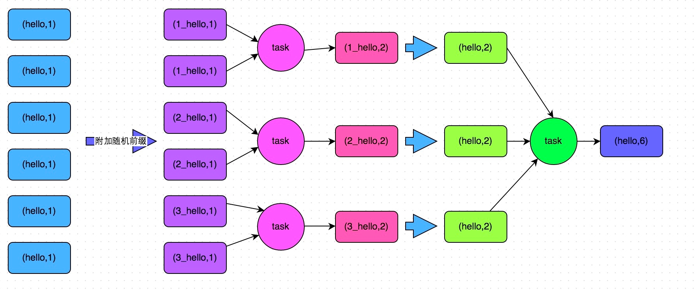
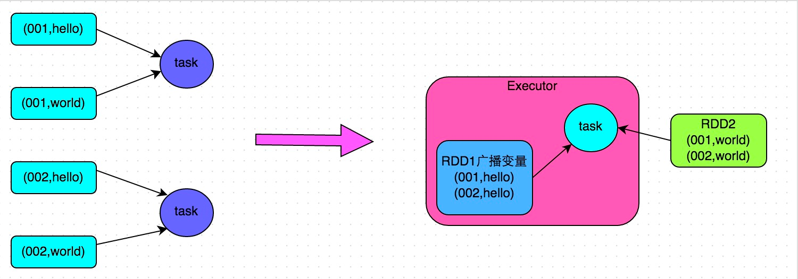
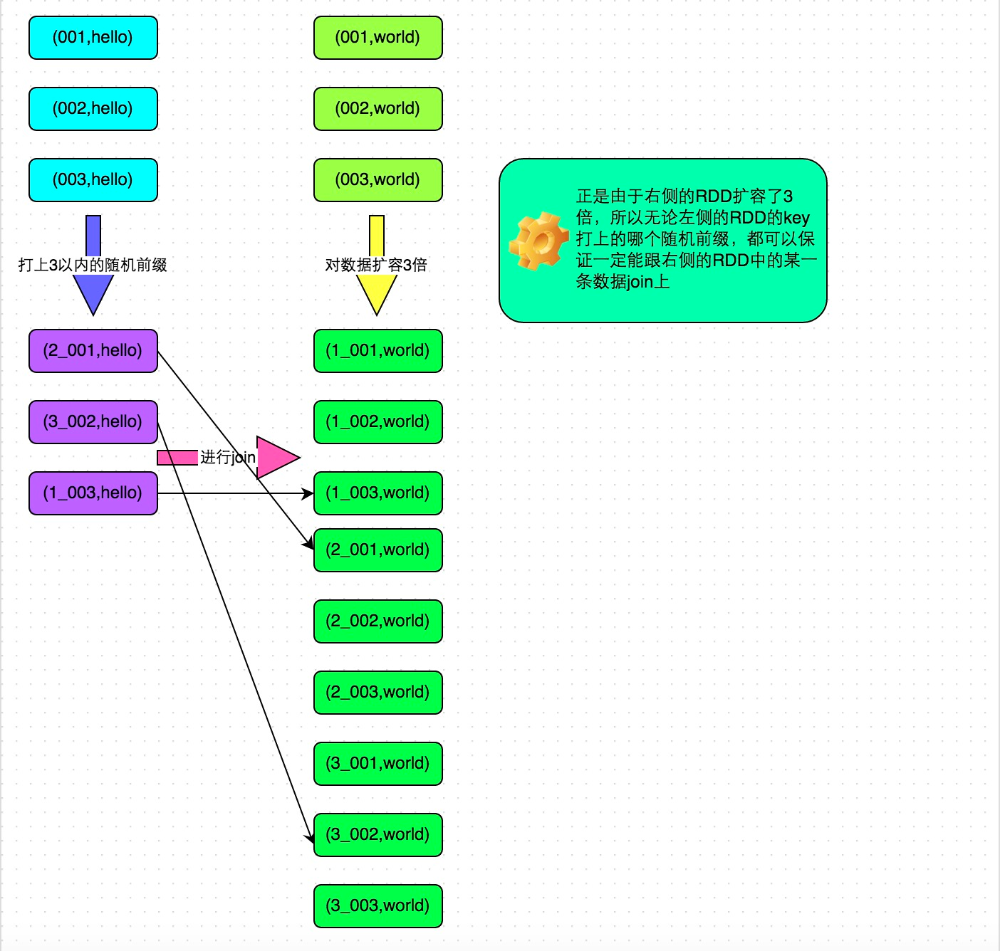

# 📖 数据倾斜
## 数据倾斜发生的原理
 - 在进行shuffle的时候，必须将各个节点上相同的key拉取到某个节点上的一个task来进行处理，比如按照key进行聚合或join等操作。此时如果某个key对应的数据量特别大的话，就会发生数据倾斜。
 - Spark作业看起来会运行得非常缓慢，甚至可能因为某个task处理的数据量过大导致内存溢出

## 定位问题
 - 数据倾斜只会发生在shuffle过程中。 可能会触发shuffle操作的算子：`distinct`、`groupByKey`、`reduceByKey`、`aggregateByKey`、`join`、`cogroup`、`repartition`等。
 
### 某个task执行特别慢的情况
### 某个task莫名其妙内存溢出的情况
     
   通过Spark Web UI查看报错的那个stage的各个task的运行时间以及分配的数据量
### 查看导致数据倾斜的key的数据分布情况, 采样
      ```scala
        val sampledPairs = pairs.sample(false, 0.1)
        val sampledWordCounts = sampledPairs.countByKey()
        sampledWordCounts.foreach(println(_))
     ```
## 解决方案
### 1. 使用Hive ETL预处理数据
     
      方案适用场景：导致数据倾斜的是Hive表。
### 2. 过滤少数导致倾斜的key
### 3. 提高shuffle操作的并行度
    
    增加shuffle read task的数量，只能缓解。这种方案只能说是在发现数据倾斜时尝试使用的第一种手段，尝试去用简单的方法缓解数据倾斜而已，或者是和其他方案结合起来使用
### 4. 分组聚合操作 两阶段聚合（局部聚合+全局聚合）
    
### 5. join操作
   5.1. join操作中的一个RDD或表的数据量比较小（比如几百M或者一两G）
      - 广播小RDD全量数据+map算子
      - 只适用于一个大表和一个小表的情况
   
   
   
   ```scala
    // 首先将数据量比较小的RDD的数据，collect到Driver中来。
    List<Tuple2<Long, Row>> rdd1Data = rdd1.collect()
    // 然后使用Spark的广播功能，将小RDD的数据转换成广播变量，这样每个Executor就只有一份RDD的数据。
    // 可以尽可能节省内存空间，并且减少网络传输性能开销。
    final Broadcast<List<Tuple2<Long, Row>>> rdd1DataBroadcast = sc.broadcast(rdd1Data);
      
    // 对另外一个RDD执行map类操作，而不再是join类操作。
    JavaPairRDD<String, Tuple2<String, Row>> joinedRdd = rdd2.mapToPair(
            new PairFunction<Tuple2<Long,String>, String, Tuple2<String, Row>>() {
                private static final long serialVersionUID = 1L;
                @Override
                public Tuple2<String, Tuple2<String, Row>> call(Tuple2<Long, String> tuple)
                        throws Exception {
                    // 在算子函数中，通过广播变量，获取到本地Executor中的rdd1数据。
                    List<Tuple2<Long, Row>> rdd1Data = rdd1DataBroadcast.value();
                    // 可以将rdd1的数据转换为一个Map，便于后面进行join操作。
                    Map<Long, Row> rdd1DataMap = new HashMap<Long, Row>();
                    for(Tuple2<Long, Row> data : rdd1Data) {
                        rdd1DataMap.put(data._1, data._2);
                    }
                    // 获取当前RDD数据的key以及value。
                    String key = tuple._1;
                    String value = tuple._2;
                    // 从rdd1数据Map中，根据key获取到可以join到的数据。
                    Row rdd1Value = rdd1DataMap.get(key);
                    return new Tuple2<String, String>(key, new Tuple2<String, Row>(value, rdd1Value));
                }
            });
      
    // 这里得提示一下。
    // 上面的做法，仅仅适用于rdd1中的key没有重复，全部是唯一的场景。
    // 如果rdd1中有多个相同的key，那么就得用flatMap类的操作，在进行join的时候不能用map，而是得遍历rdd1所有数据进行join。
    // rdd2中每条数据都可能会返回多条join后的数据。
   ```
   5.2. 数据倾斜的key少量： 采样倾斜key并分拆join操作,
     
     原理：对于join导致的数据倾斜，如果只是某几个key导致了倾斜，可以将少数几个key分拆成独立RDD，并附加随机前缀打散成n份去进行join，此时这几个key对应的数据就不会集中在少数几个task上，而是分散到多个task进行join了
     缺点：如果导致倾斜的key特别多的话，比如成千上万个key都导致数据倾斜，那么这种方式也不适合。
   
   ```scala
       // 首先从包含了少数几个导致数据倾斜key的rdd1中，采样10%的样本数据。
        JavaPairRDD<Long, String> sampledRDD = rdd1.sample(false, 0.1);
          
        // 对样本数据RDD统计出每个key的出现次数，并按出现次数降序排序。
        // 对降序排序后的数据，取出top 1或者top 100的数据，也就是key最多的前n个数据。
        // 具体取出多少个数据量最多的key，由大家自己决定，我们这里就取1个作为示范。
        JavaPairRDD<Long, Long> mappedSampledRDD = sampledRDD.mapToPair(
                new PairFunction<Tuple2<Long,String>, Long, Long>() {
                    private static final long serialVersionUID = 1L;
                    @Override
                    public Tuple2<Long, Long> call(Tuple2<Long, String> tuple)
                            throws Exception {
                        return new Tuple2<Long, Long>(tuple._1, 1L);
                    }     
                });
        JavaPairRDD<Long, Long> countedSampledRDD = mappedSampledRDD.reduceByKey(
                new Function2<Long, Long, Long>() {
                    private static final long serialVersionUID = 1L;
                    @Override
                    public Long call(Long v1, Long v2) throws Exception {
                        return v1 + v2;
                    }
                });
        JavaPairRDD<Long, Long> reversedSampledRDD = countedSampledRDD.mapToPair( 
                new PairFunction<Tuple2<Long,Long>, Long, Long>() {
                    private static final long serialVersionUID = 1L;
                    @Override
                    public Tuple2<Long, Long> call(Tuple2<Long, Long> tuple)
                            throws Exception {
                        return new Tuple2<Long, Long>(tuple._2, tuple._1);
                    }
                });
        final Long skewedUserid = reversedSampledRDD.sortByKey(false).take(1).get(0)._2;
          
        // 从rdd1中分拆出导致数据倾斜的key，形成独立的RDD。
        JavaPairRDD<Long, String> skewedRDD = rdd1.filter(
                new Function<Tuple2<Long,String>, Boolean>() {
                    private static final long serialVersionUID = 1L;
                    @Override
                    public Boolean call(Tuple2<Long, String> tuple) throws Exception {
                        return tuple._1.equals(skewedUserid);
                    }
                });
        // 从rdd1中分拆出不导致数据倾斜的普通key，形成独立的RDD。
        JavaPairRDD<Long, String> commonRDD = rdd1.filter(
                new Function<Tuple2<Long,String>, Boolean>() {
                    private static final long serialVersionUID = 1L;
                    @Override
                    public Boolean call(Tuple2<Long, String> tuple) throws Exception {
                        return !tuple._1.equals(skewedUserid);
                    } 
                });
          
        // rdd2，就是那个所有key的分布相对较为均匀的rdd。
        // 这里将rdd2中，前面获取到的key对应的数据，过滤出来，分拆成单独的rdd，并对rdd中的数据使用flatMap算子都扩容100倍。
        // 对扩容的每条数据，都打上0～100的前缀。
        JavaPairRDD<String, Row> skewedRdd2 = rdd2.filter(
                 new Function<Tuple2<Long,Row>, Boolean>() {
                    private static final long serialVersionUID = 1L;
                    @Override
                    public Boolean call(Tuple2<Long, Row> tuple) throws Exception {
                        return tuple._1.equals(skewedUserid);
                    }
                }).flatMapToPair(new PairFlatMapFunction<Tuple2<Long,Row>, String, Row>() {
                    private static final long serialVersionUID = 1L;
                    @Override
                    public Iterable<Tuple2<String, Row>> call(
                            Tuple2<Long, Row> tuple) throws Exception {
                        Random random = new Random();
                        List<Tuple2<String, Row>> list = new ArrayList<Tuple2<String, Row>>();
                        for(int i = 0; i < 100; i++) {
                            list.add(new Tuple2<String, Row>(i + "_" + tuple._1, tuple._2));
                        }
                        return list;
                    }
                      
                });
         
        // 将rdd1中分拆出来的导致倾斜的key的独立rdd，每条数据都打上100以内的随机前缀。
        // 然后将这个rdd1中分拆出来的独立rdd，与上面rdd2中分拆出来的独立rdd，进行join。
        JavaPairRDD<Long, Tuple2<String, Row>> joinedRDD1 = skewedRDD.mapToPair(
                new PairFunction<Tuple2<Long,String>, String, String>() {
                    private static final long serialVersionUID = 1L;
                    @Override
                    public Tuple2<String, String> call(Tuple2<Long, String> tuple)
                            throws Exception {
                        Random random = new Random();
                        int prefix = random.nextInt(100);
                        return new Tuple2<String, String>(prefix + "_" + tuple._1, tuple._2);
                    }
                })
                .join(skewedUserid2infoRDD)
                .mapToPair(new PairFunction<Tuple2<String,Tuple2<String,Row>>, Long, Tuple2<String, Row>>() {
                                private static final long serialVersionUID = 1L;
                                @Override
                                public Tuple2<Long, Tuple2<String, Row>> call(
                                    Tuple2<String, Tuple2<String, Row>> tuple)
                                    throws Exception {
                                    long key = Long.valueOf(tuple._1.split("_")[1]);
                                    return new Tuple2<Long, Tuple2<String, Row>>(key, tuple._2);
                                }
                            });
         
        // 将rdd1中分拆出来的包含普通key的独立rdd，直接与rdd2进行join。
        JavaPairRDD<Long, Tuple2<String, Row>> joinedRDD2 = commonRDD.join(rdd2);
         
        // 将倾斜key join后的结果与普通key join后的结果，uinon起来。
        // 就是最终的join结果。
        JavaPairRDD<Long, Tuple2<String, Row>> joinedRDD = joinedRDD1.union(joinedRDD2);
   ```
   
   
  5.3 有大量的key导致数据倾斜: 使用随机前缀和扩容RDD进行join
   
       需要对整个RDD进行扩容，对内存资源要求很高
    ```scala
        // 首先将其中一个key分布相对较为均匀的RDD膨胀100倍。
        JavaPairRDD<String, Row> expandedRDD = rdd1.flatMapToPair(
        new PairFlatMapFunction<Tuple2<Long,Row>, String, Row>() {
            private static final long serialVersionUID = 1L;
            @Override
            public Iterable<Tuple2<String, Row>> call(Tuple2<Long, Row> tuple)
                    throws Exception {
                List<Tuple2<String, Row>> list = new ArrayList<Tuple2<String, Row>>();
                for(int i = 0; i < 100; i++) {
                    list.add(new Tuple2<String, Row>(0 + "_" + tuple._1, tuple._2));
                }
                return list;
            }
        });
    // 其次，将另一个有数据倾斜key的RDD，每条数据都打上100以内的随机前缀。
    JavaPairRDD<String, String> mappedRDD = rdd2.mapToPair(
            new PairFunction<Tuple2<Long,String>, String, String>() {
                private static final long serialVersionUID = 1L;
                @Override
                public Tuple2<String, String> call(Tuple2<Long, String> tuple)
                        throws Exception {
                    Random random = new Random();
                    int prefix = random.nextInt(100);
                    return new Tuple2<String, String>(prefix + "_" + tuple._1, tuple._2);
                }
            });
      
    // 将两个处理后的RDD进行join即可。
    JavaPairRDD<String, Tuple2<String, Row>> joinedRDD = mappedRDD.join(expandedRDD);
    ```

  - vs:
   方案一 将rdd1中分拆出来的导致倾斜的key的独立rdd，每条数据都打上100以内的随机前缀。
   方案二 对整个RDD进行扩容
### 6. 多种方案组合使用
