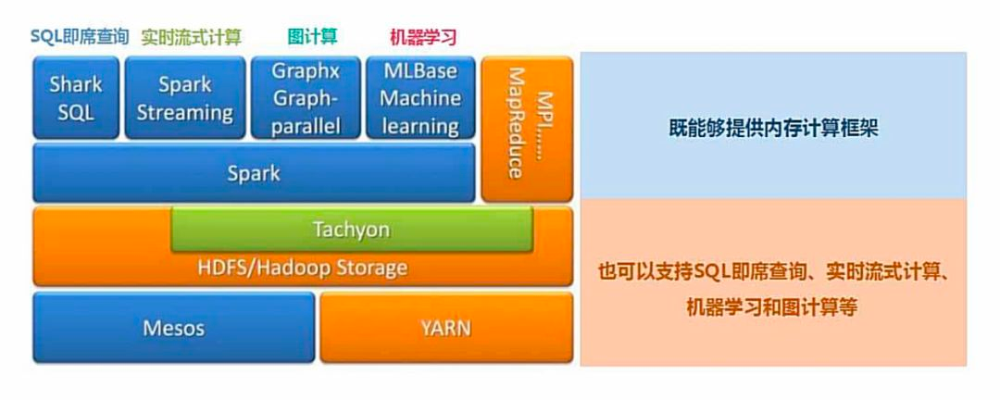
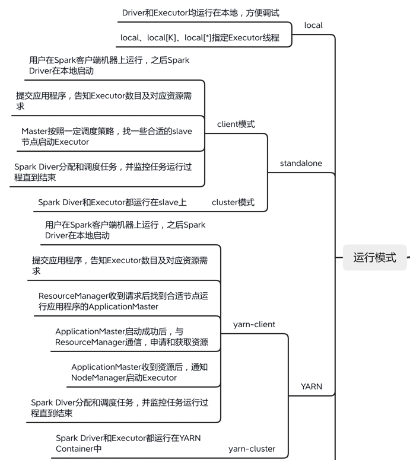
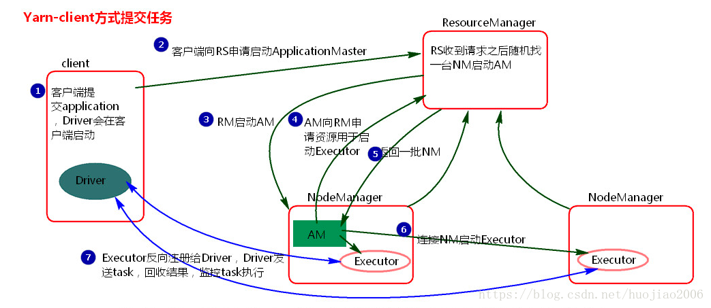
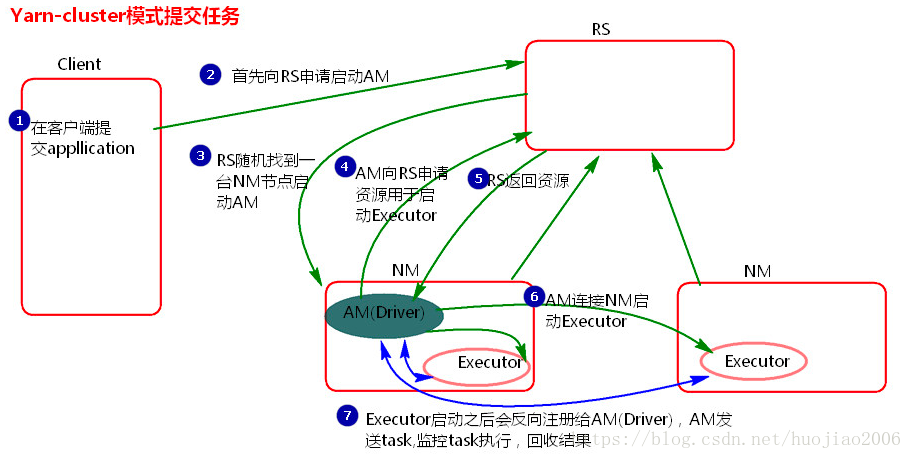
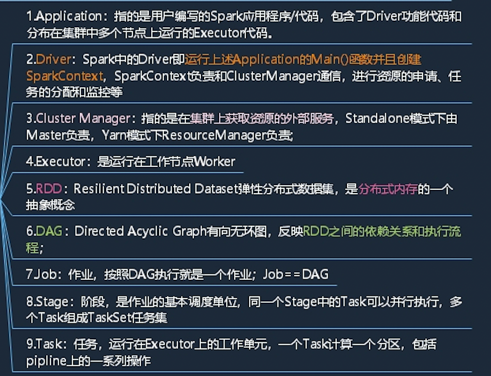
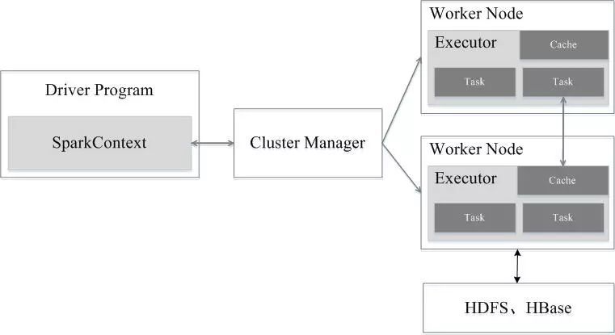
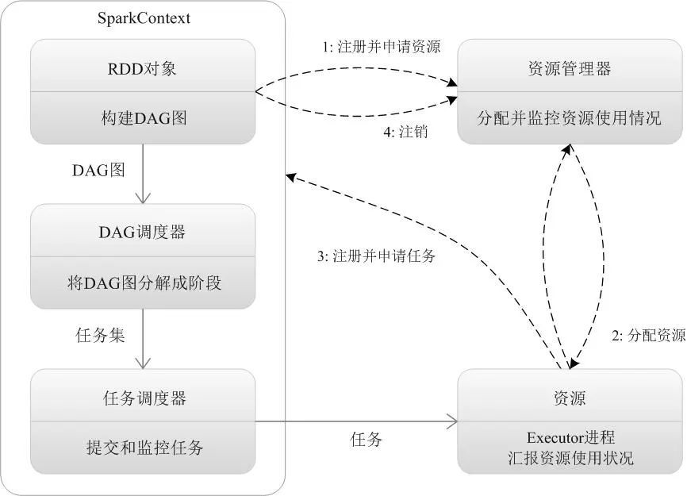
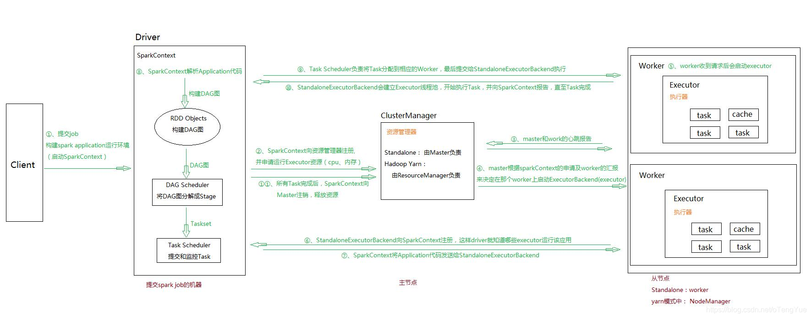
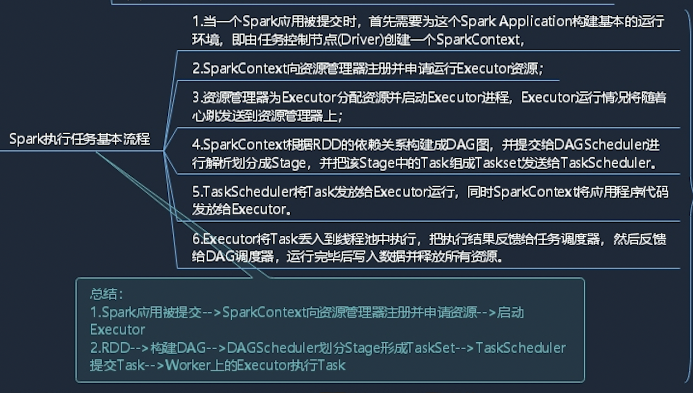

# 📖 spark基础

- [架构设计](#架构设计)
- [运行模式](#运行模式)
  - [local](#local)
  - [standalone](#standalone)
  - [yarn](#yarn)
- [环境搭建](#环境搭建)
- [基础概念](#基础概念)
- [任务基本流程](#任务基本流程)
- [参考资料](#参考资料)

# 架构设计

# 运行模式


## local
 - local：所有计算都运行在一个线程当中，没有任何并行计算，通常我们在本机执行一些测试代码，或者练手，就用这种模式; 
 - local[K]：指定使用几个线程来运行计算，比如local[4]就是运行4个worker线程。通常我们的cpu有几个core，就指定几个线程，最大化利用cpu的计算能力; 
 - local[*]：这种模式直接帮你按照cpu最多cores来设置线程数了。

```shell
bin/spark-submit \
--class org.apache.spark.examples.SparkPi \
--executor-memory 1G \
--total-executor-cores 2 \
./examples/jars/spark-examples_2.11-2.1.1.jar \
100    ==> 该数字代表迭代次数
```
## standalone

 - 构建一个由Master+Slave构成的Spark集群，Spark运行在集群中

## yarn

- client
  - 客户端
  driver在客服端
  - spark
    - RM
    - AM
    - NM
    

 - cluster
   - 客户端
   - spark
     - RM yarn的老大
     - AM spark任务的老大 driver在AM
     - NM 真正干活的


# 环境搭建
# 基础概念


# 任务基本流程
- 粗粒度




- 细粒度



#参考资料
- [Dr11ft/BigDataGuide](https://github.com/ustbly/BigDataGuide/blob/master/Spark/3%E3%80%81Spark%E8%BF%90%E8%A1%8C%E6%A8%A1%E5%BC%8F.md) 📚
