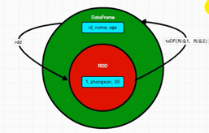
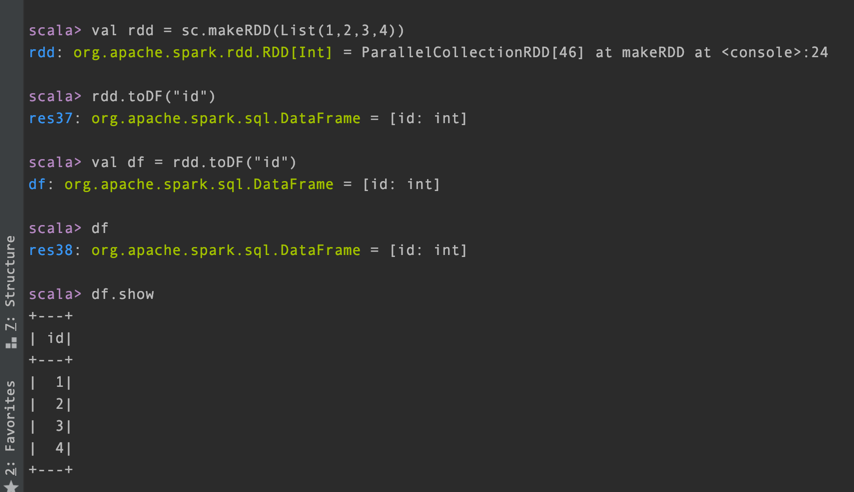
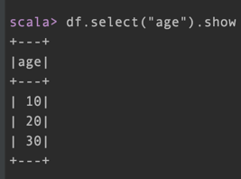
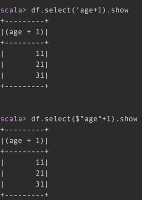

[TOC]

## [spark SQL](basics)


- [DataFrame&DataSet](basics/spark-core.md)
- [SQL的基本使用](basics/spark-core.md)
- [DSL语法的基本使用](basics/spark-core.md)
- [RDD之间的转换](basics/spark-core.md)
- [SQL的基本使用](basics/spark-core.md)
- [SQL的基本使用](basics/spark-core.md)


# 基本概念
## DataFrame
```DataFrame = Schema(表结构) + RDD（代表数据）```
## DataSet
   数据的分布式集合.Dataset是在Spark 1.6中添加的一个新接口，是DataFrame之上更高一级的抽象。


# DataFrame
示例文件： user.json
数据格式：
```json
{"username":"zhhangsan", "age":  10}
{"username":"wanwu", "age":  20}
{"username":"zhhangsan", "age":  30}
```

SparkSession是创建DataFrame和执行SQL的入口


## DataFrame创建
### 从spark数据源创建
 `spark.read.[json,text, ....]`
从内存中可获取数据类型，但文件中读取获取不到,数字用bigint接受不了

### RDD
- RDD与DataFrame互相转化
    

     

### Hive

### SQL的基本使用

```df.createOrReplaceTempView("user")
```

- table VS View
table 可修改
View 查询
- 普通临时表是session范围内的， df.createOrReplaceGlobalTempView VS df.createOrReplaceTempView

```scala
  spark.newSession.sql("select * from global_user.user")
  spark.newSession.sql("select * from global_temp.emp")
```
### DSL语法的基本使用

- 查看列数据 如"age+1"


- 列数据运算 如"age+1", 每个列都必须添加 列前加'或$
  ```df.select("age"+1).show ``` 报错

# DSL语法的基本使用
# RDD之间的转换
