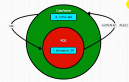
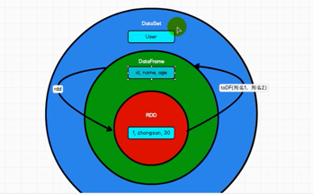

[TOC]

## [spark SQL](basics)


- [DataFrame&DataSet](basics/spark-core.md)
- [SQL的基本使用](basics/spark-core.md)
- [DSL语法的基本使用](basics/spark-core.md)
- [RDD之间的转换](basics/spark-core.md)
- [SQL的基本使用](basics/spark-core.md)
- [SQL的基本使用](basics/spark-core.md)


# 基本概念
## DataFrame
```DataFrame = Schema(表结构) + RDD（代表数据）```
## DataSet
   数据的分布式集合.Dataset是在Spark 1.6中添加的一个新接口，是DataFrame之上更高一级的抽象。


# DataFrame

 SparkSession是创建DataFrame和执行SQL的入口

示例文件： user.json
数据格式：
```json
{"username":"zhhangsan", "age":  10}
{"username":"wanwu", "age":  20}
{"username":"zhhangsan", "age":  30}
```
## 基本用法


## DataFrame创建
### 从spark数据源创建
 `spark.read.[json,text, ....]`
从内存中可获取数据类型，但文件中读取获取不到,数字用bigint接受不了

### RDD
- RDD与DataFrame互相转化
    
    
- 示例
    

### Hive

### SQL的基本使用

```df.createOrReplaceTempView("user")
```

- table VS View
table 可修改
View 查询
- 普通临时表是session范围内的， df.createOrReplaceGlobalTempView VS df.createOrReplaceTempView

```scala
  spark.newSession.sql("select * from global_user.user")
  spark.newSession.sql("select * from global_temp.emp")
```
### DSL语法的基本使用

- 查看列数据


- 列数据运算 如"age+1", 每个列前加'或$
  
  ```df.select("age"+1).show ``` 报错

  

# DataSet

## 创建
- DataFrame => DataSet
```shell
scala> val df = spark.read.json("/Users/liusj/spark-demo/datas/user.json")
df: org.apache.spark.sql.DataFrame = [age: bigint, username: string]

scala> df.show
+---+---------+
|age| username|
+---+---------+
| 10|zhhangsan|
| 20|    wanwu|
| 30|zhhangsan|
+---+---------+

scala> case class emp(username:String, age:Long)
defined class emp

scala> val ds = df.as[emp]
ds: org.apache.spark.sql.Dataset[emp] = [age: bigint, username: string]

scala> ds.show
+---+---------+
|age| username|
+---+---------+
| 10|zhhangsan|
| 20|    wanwu|
| 30|zhhangsan|
+---+---------+
```
- DataSet => DataFrame

  ```ds.toDF()```

- RDD <=> DataSet

```shell
scala> case class emp(username:String, age:Long)
scala> val rdd = sc.makeRDD(List(emp("zhang", 30), emp("HAHAH", 10)))
rdd: org.apache.spark.rdd.RDD[emp] = ParallelCollectionRDD[36] at makeRDD at <console>:26

scala> rdd.toDS
res16: org.apache.spark.sql.Dataset[emp] = [username: string, age: bigint]
scala> rdd.toDS.rdd
res17: org.apache.spark.rdd.RDD[emp] = MapPartitionsRDD[39] at rdd at <console>:26
```

# RDD  DataFrame  DataSet 转化关系

