# 📖 spark SQL
* [基本概念](#基本概念)
   * [DataFrame](#dataframe)
   * [DataSet](#dataset)
   * [SparkSession](#sparksession)
* [DataFrame](#dataframe-1)
   * [基本用法](#基本用法)
   * [DataFrame创建](#dataframe创建)
      * [从spark数据源创建](#从spark数据源创建)
      * [RDD](#rdd)
      * [Hive](#hive)
   * [SQL的基本使用](#sql的基本使用)
      * [DSL语法的基本使用](#dsl语法的基本使用)
* [DataSet](#dataset-1)
   * [创建](#创建)
* [RDD  DataFrame  DataSet 转化关系](#rdd--dataframe--dataset-转化关系)
* [UDF函数](#udf函数)
   * [弱类型](#弱类型)
   * [强类型](#强类型)
* [文件读取](#文件读取)
   * [csv](#csv)
   * [Mysql](#mysql)
   * [Hive](#hive-1)
      * [内置](#内置)
      * [外置](#外置)


# 基本概念
## DataFrame
```DataFrame = Schema(表结构) + RDD（代表数据）```
## DataSet
   数据的分布式集合.Dataset是在Spark 1.6中添加的一个新接口，是DataFrame之上更高一级的抽象。
## SparkSession
 - SparkSession作为DataSet和DataFrame API的切入点，SparkSession封装了SparkConf、SparkContext和SQLContext。

# DataFrame

 SparkSession是创建DataFrame和执行SQL的入口

- 示例文件：
  `user.json`数据格式：
    ```json
    {"username":"zhhangsan", "age":  10}
    {"username":"wanwu", "age":  20}
    {"username":"zhhangsan", "age":  30}
    ```
## 基本用法
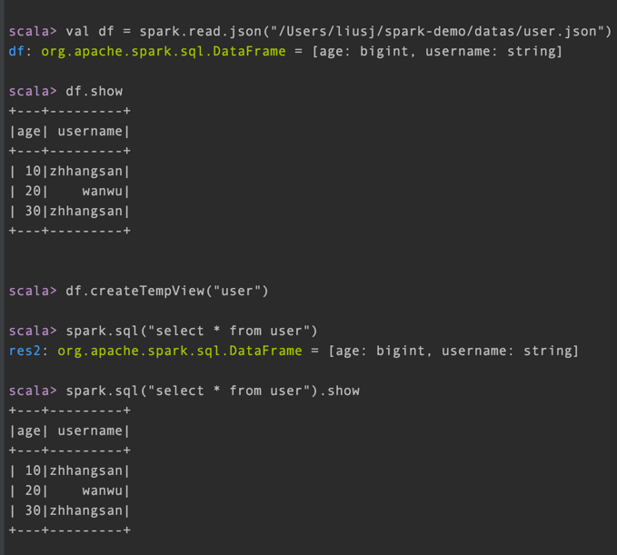
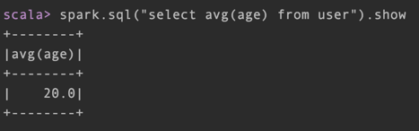

## DataFrame创建
### 从spark数据源创建
 `spark.read.[json,text, ....]`
   
  从内存中可获取数据类型，但文件中读取获取不到,数字用bigint接受不了

### RDD
- 示例
    
  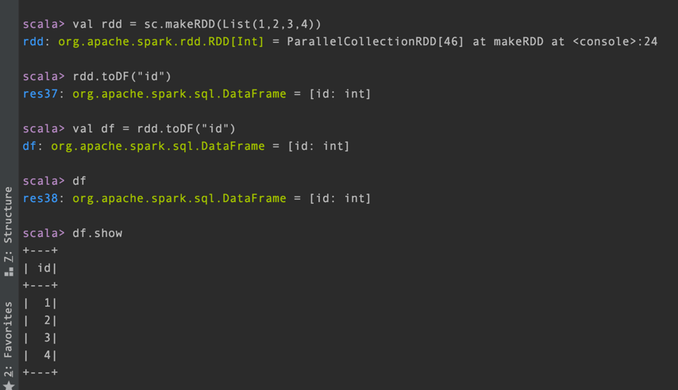

### Hive

## SQL的基本使用

```scala
    df.createOrReplaceTempView("user")
```

- table VS View

    `table 可修改
     View 查询`
- 普通临时表是session范围内的， df.createOrReplaceGlobalTempView VS df.createOrReplaceTempView
```scala
  spark.newSession.sql("select * from global_user.user")
  spark.newSession.sql("select * from global_temp.emp")
```
### DSL语法的基本使用

- 查看列数据

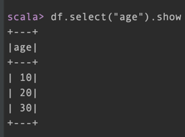

- 列数据运算 如"age+1", 每个列前加'或$
  
  ```df.select("age"+1).show ``` 报错

  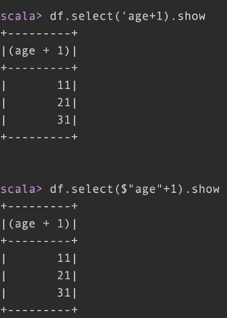

# DataSet

## 创建
- DataFrame => DataSet

```shell
scala> val df = spark.read.json("/Users/liusj/spark-demo/datas/user.json")
df: org.apache.spark.sql.DataFrame = [age: bigint, username: string]

scala> df.show
+---+---------+
|age| username|
+---+---------+
| 10|zhhangsan|
| 20|    wanwu|
| 30|zhhangsan|
+---+---------+

scala> case class emp(username:String, age:Long)
defined class emp

scala> val ds = df.as[emp]
ds: org.apache.spark.sql.Dataset[emp] = [age: bigint, username: string]

scala> ds.show
+---+---------+
|age| username|
+---+---------+
| 10|zhhangsan|
| 20|    wanwu|
| 30|zhhangsan|
+---+---------+
```

- DataSet => DataFrame

  ```ds.toDF()```

- RDD <=> DataSet

```shell
    scala> case class emp(username:String, age:Long)
    scala> val rdd = sc.makeRDD(List(emp("zhang", 30), emp("HAHAH", 10)))
    rdd: org.apache.spark.rdd.RDD[emp] = ParallelCollectionRDD[36] at makeRDD at <console>:26
    
    scala> rdd.toDS
    res16: org.apache.spark.sql.Dataset[emp] = [username: string, age: bigint]
    scala> rdd.toDS.rdd
    res17: org.apache.spark.rdd.RDD[emp] = MapPartitionsRDD[39] at rdd at <console>:26
```

# RDD  DataFrame  DataSet 转化关系
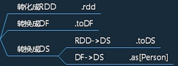

```scala
  type DataFrame = Dataset[Row]
```
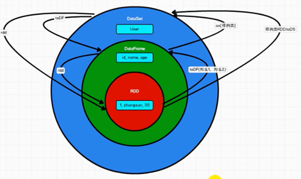

```scala
package spark.sql

import org.apache.spark.rdd.RDD
import org.apache.spark.sql.{DataFrame, Dataset, Row, SparkSession}
import org.apache.spark.{SparkConf, SparkContext}

object Basic {
  def main(args: Array[String]): Unit = {
    val sparkConf: SparkConf = new SparkConf().setMaster("local").setAppName("Bc")
    val sess = SparkSession.builder().config(sparkConf).getOrCreate()
    import sess.implicits._

    // DataFrame
    //    val df: DataFrame = sess.read.json("datas/user.json")
    //df.show()

    //DataFrame => SQL
    //    df.createOrReplaceTempView("user")
    //    sess.sql("select age, username from user").show
    //    sess.sql("select avg(age) from user").show

    //DataFrame => DSL
    //    //转换操作,需引入转换规则
    //    df.select("age", "username").show()
    //    df.select($"age"+1).show()

    //RDD => Dataset
    //    val seq = Seq(1, 2, 3, 4)
    //    val ds: Dataset[Int] = seq.toDS()
    //    ds.show()

    //DataSet DataFrame是特定泛型DataSet
    // DataFrame方法都适合DataSet
    //    val ds = sess.read.json("datas/user.json")
    //    ds.createOrReplaceTempView("user")
    //    sess.sql("select age, username from user").show

    //RDD <=> DataFrame
    val rdd = sess.sparkContext.makeRDD(List((1, "zhangsan", 40), (2, "wangwu", 2)))
    val df = rdd.toDF("id", "name", "age")
    val rdd1: RDD[Row] = df.rdd

    //DataSet <=> DataFrame
    val ds: Dataset[User] = df.as[User] // df => ds
    ds.toDF() // ds => df


    //RDD <=> DataSet
    val ds1: Dataset[User] = rdd.map {
      case (id, name, age) => {
        User(id, name, age)
      }
    }.toDS()
    val rdd2: RDD[User] = ds1.rdd
    sess.close()

  }

  case class User(id: Int, name: String, age: Int)

}

```

# 自定义函数
- UDF(User Defined Functions)是普通的不会产生Shuffle不会划分新的阶段的用户自定义函数，
- UDAF(User Defined Aggregator Functions)则会打乱分区，用户自定义聚合函数。
## UDF
```scala
    import org.apache.spark.sql.functions  // DSL中定义UDF需要
    
    val rdd: RDD[User] = spark.sparkContext.makeRDD(
      List(User("Bob", 23), User("Alice", 22), User("John", 24)))
    val ds: Dataset[User] = rdd.toDS
    ds.createOrReplaceTempView("user")
    
    // SQL中使用就需要注册UDF
    spark.udf.register("add_name", (str: String) => { "Name: " + str })
    spark.sql("select name, add_name(name) as new_name from user").show()
    
    // 使用DSL则不用注册，定义好直接使用即可
    val add_name2: UserDefinedFunction = functions.udf((str: String) => {
      "Name: " + str
    })
    ds.withColumn("name", add_name2($"name")).show()  
```
## UDAF
### 弱类型
- ~~UserDefinedAggregateFunction~~ 已弃用
### 强类型
```text
store,user,payment
1,Bob,12.00
1,Alice,44.12
1,John,23.20
2,Davin,79.00
2,Lim,33.30
...
```

- Aggregator（Spark3.0版本以后）
  ```scala
  spark.udf.register("myudaf02", functions.udaf(new MyUDAF02))  // 注册UDAF函数
  spark.sql(
  """
    |select store, myudaf02(payment) from record group by store
    |""".stripMargin).show(truncate = false)
  ```
  
  - UDAF类
  ```scala
    case class StoreSummary(var user: Int, var payment: Double)  // 强类型UDAF函数Buffer类型
    
    class MyUDAF02 extends Aggregator[Double, StoreSummary, String] {
      
      // 初始化Buffer中的字段
      override def zero: StoreSummary = {
        StoreSummary(0, 0.00)
      }
    
      // 输入到Buffer的聚合
      override def reduce(b: StoreSummary, a: Double): StoreSummary = {
        b.user += 1
        b.payment += a
        b
      }
    
      // 合并Buffer
      override def merge(b1: StoreSummary, b2: StoreSummary): StoreSummary = {
        b1.user += b2.user
        b1.payment += b2.payment
        b1
      }
    
      // 最终的计算结果
      override def finish(reduction: StoreSummary): String = {
        "user: " + reduction.user + ",payment: " + reduction.payment
      }
    
      // Dataset默认编码器，用于序列化，固定写法
      override def bufferEncoder: Encoder[StoreSummary] = Encoders.product
    
      override def outputEncoder: Encoder[String] = Encoders.STRING
    }
  ```
- Aggregator（Spark3.0版本以前）

早期版本中不能在SQL中使用强类型UDAF，但是可以在DSL中使用，代码编写和调用方式都有所不同，DSL注重的是类型，所以在UDAF输入类型这里传入的应该是DataSet每一行的类型，而不是固定字段的某个类型。
```scala
    // 样例类，写在main方法外
    case class Record(store: Int, name: String, payment: Double)
    
    class MyUDAF03 extends Aggregator[Record, StoreSummary, String] {
    override def zero: StoreSummary = {
      StoreSummary(0, 0.00)
    }

    override def reduce(b: StoreSummary, a: Record): StoreSummary = {
      b.user += 1
      b.payment += a.payment
      b
    }

    override def merge(b1: StoreSummary, b2: StoreSummary): StoreSummary = {
      b1.user += b2.user
      b1.payment += b2.payment
      b1
    }

    override def finish(reduction: StoreSummary): String = {
      "user: " + reduction.user + ",payment: " + reduction.payment
    }

    override def bufferEncoder: Encoder[StoreSummary] = Encoders.product

    override def outputEncoder: Encoder[String] = Encoders.STRING
  }

```
# 文件读取

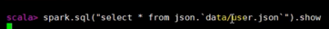

```scala
scala>  sess.read.load
scala> sess.read.json("filename")
scala> spark.sql("select * from json.`datas/user.json`").show
+---+---------+
|age| username|
+---+---------+
| 10|zhhangsan|
| 20|    wanwu|
| 30|zhhangsan|
+---+---------+
scala>  df.write.save("filename")
scala>  df.write.save("filename") //报错。已存在
scala> df.write.format("json").mode("ignore").save("out") //不报错
```

## csv
```scala
val dataFrame: DataFrame = spark.read.format("csv")
      .option("header", "true")
      .option("encoding", "gbk2312")
      .load(path)
```

## Mysql

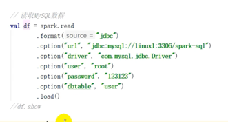

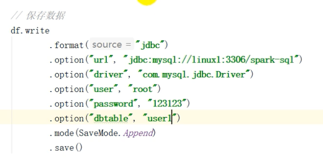

## Hive
### 内置
### 外置
- 连接方法

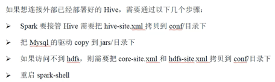
