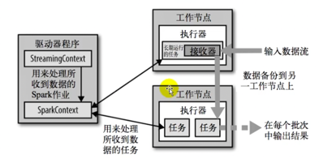

# 📖 SparkStreaming

# 

## 数据处理方式
- 数据处理的方式角度
流式处理
批量处理

- 数据处理延迟的长短 
实时处理 毫秒
离线处理 小时 or 天

SparkStreaming 准实时（秒，分钟），微批次（设置时间）的数据处理框架

## 原理

* 离散化流 Dstream 对RDD的封装
* 时间区间
* 背压机制

## 案例【WordCount】
### 无状态
只记录时间区间的值
### 有状态
保存临时数据，根据key做更新

## DStream转换
### transform
### join
### windowOperations
    - 窗口
    - 步长
### DStream输出
没有输出，会提示错误
foreachRDD

### 优雅关闭采集器
- 创建新的线程，需要在第三方程序中增加关闭状态
- 线程不断轮训

多个采集周期作为一个整体

## 案例
优化
- 一个分区创建一个连接对象
- 连接不能写在driver上
- 算子在excuter执行 