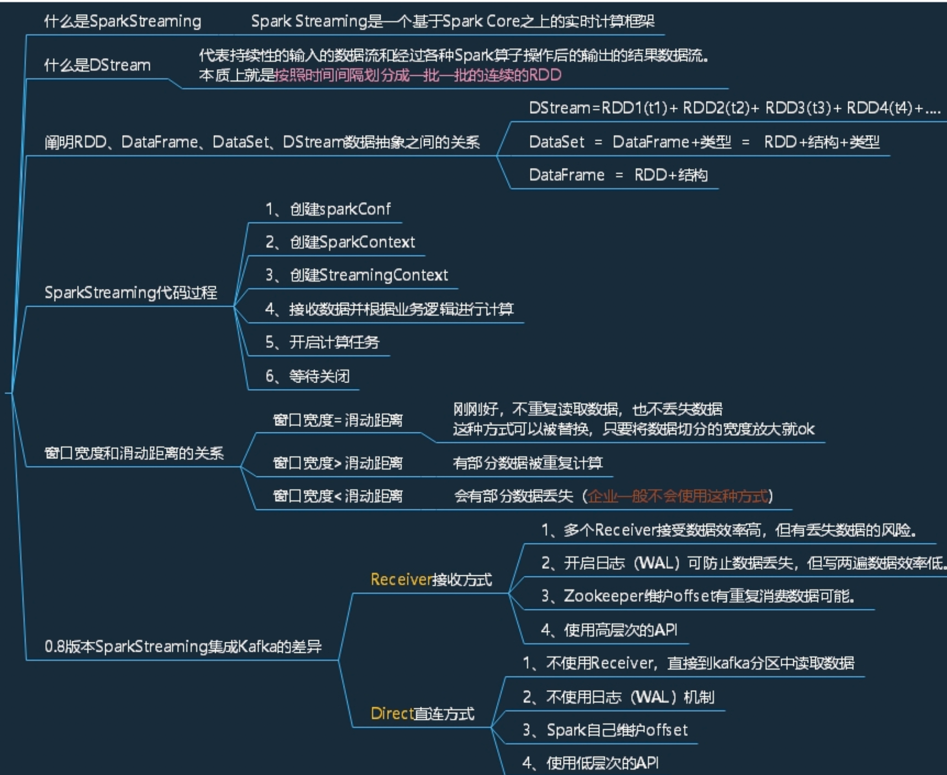

# 📖 SparkStreaming
* [数据处理方式](#数据处理方式)
* [原理](#原理)
* [案例【WordCount】](#案例wordcount)
   * [无状态](#无状态)
   * [有状态](#有状态)
* [DStream转换](#dstream转换)
   * [transform](#transform)
   * [join](#join)
   * [windowOperations](#windowoperations)
   * [DStream输出](#dstream输出)
   * [优雅关闭采集器](#优雅关闭采集器)
* [案例](#案例)



 
## 数据处理方式
- 数据处理的方式角度
   - 流式处理
   - 批量处理

- 数据处理延迟的长短 
  - 实时处理 毫秒
  - 离线处理 小时 or 天

SparkStreaming 准实时（秒，分钟），微批次（设置时间）的数据处理框架

## 原理


* 离散化流 Dstream 对RDD的封装
* 时间区间
* 背压机制

## 案例【WordCount】
```scala
import org.apache.spark._
import org.apache.spark.streaming._
import org.apache.spark.streaming.StreamingContext._
// Create a local StreamingContext with two working thread and batch interval of 1 second
val conf = new SparkConf().setMaster("local[2]").setAppName("NetworkWordCount")
val ssc = new StreamingContext(conf, Seconds(1))
// Create a DStream that will connect to hostname:port, like localhost:9999
val lines = ssc.socketTextStream("localhost", 9999)
// Split each line into words
val words = lines.flatMap(_.split(" "))

import org.apache.spark.streaming.StreamingContext._
// Count each word in each batch
val pairs = words.map(word => (word, 1))
val wordCounts = pairs.reduceByKey(_ + _)
// Print the first ten elements of each RDD generated in this DStream to the console
wordCounts.print()

ssc.start()             // Start the computation
ssc.awaitTermination()  // Wait for the computation to terminate

```

```shell
$ nc -lk 9999
```
### 无状态
只记录时间区间的值
### 有状态
保存临时数据，根据key做更新

## DStream转换
### transform
### join
### windowOperations
    - 窗口
    - 步长
### DStream输出
没有输出，会提示错误
foreachRDD

### 优雅关闭采集器
- 创建新的线程，需要在第三方程序中增加关闭状态
- 线程不断轮训

多个采集周期作为一个整体

## 案例
优化
- 一个分区创建一个连接对象
- 连接不能写在driver上
- 算子在excuter执行 